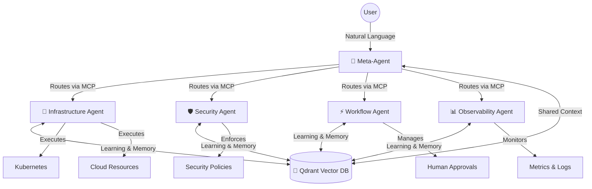

# AI-Powered Integrated Developer Platform (IDP) - Multi-Agent Architecture

## 🎯 Revolutionary Multi-Agent Approach

This IDP uses a **Meta-Agent + Focused Agents + Shared Intelligence** architecture to eliminate infrastructure complexity through conversational AI. Instead of learning platform abstractions, developers simply describe what they want in natural language, and specialized AI agents handle all the complexity.

## 🏗️ Architecture Overview



## 🤖 Agent Roles

### 🧠 Meta-Agent (Orchestrator)
- **Intelligent Routing**: Classifies user intents and routes to appropriate focused agents
- **Context Management**: Manages conversation context and shared memory via Qdrant
- **Response Coordination**: Aggregates and formats responses from multiple agents
- **Decision Making**: Makes high-level decisions about multi-agent workflows

### 🔧 Infrastructure Agent
- **Kubernetes Operations**: Deploy, scale, status, logs, rollback, networking
- **Cloud Integration**: Multi-cloud resource management
- **MCP Server**: Exposes infrastructure operations via Model Context Protocol
- **Learning**: Stores deployment patterns and infrastructure state in Qdrant

### 🛡️ Security Agent  
- **Policy Enforcement**: RBAC, compliance, and security policy validation
- **Risk Assessment**: Dynamic risk evaluation with ML-based scoring
- **Threat Detection**: Real-time security monitoring and alerting
- **Adaptive Learning**: Evolves security policies based on patterns in Qdrant

### ⚡ Workflow Agent
- **Approval Orchestration**: Human-in-the-loop workflows with intelligent routing
- **Process Management**: Complex multi-step workflow execution
- **Integration Hub**: Slack, email, webhooks, and notification management
- **Decision History**: Stores approval patterns and decision contexts in Qdrant

### 📊 Observability Agent
- **Monitoring Integration**: Logs, metrics, traces, and alerting
- **Incident Management**: Automated incident response and escalation
- **Compliance Reporting**: Audit trails and regulatory compliance
- **Intelligence Layer**: Pattern recognition and predictive analytics from Qdrant

## 🔧 Technology Stack

- **Meta-Agent**: TypeScript + Fastify (orchestration)
- **Focused Agents**: Independent MCP servers (Node.js/Python)
- **Vector Database**: Qdrant Cloud (shared intelligence)
- **Communication**: MCP (Model Context Protocol)
- **Web Interface**: Next.js 15 + React 19 + Tailwind CSS
- **Database**: PostgreSQL + Redis
- **AI**: Anthropic Claude + OpenAI GPT-4

## 🚀 Quick Start

### Prerequisites
- Node.js 20+
- Docker & Docker Compose
- Qdrant Cloud account (free tier)
- Anthropic API key

### 1. Environment Setup
```bash
# Clone repository
git clone <repository-url>
cd ai-idp

# Copy environment template
cp .env.example .env

# Add your API keys:
# ANTHROPIC_API_KEY=your_key
# QDRANT_URL=your_qdrant_cloud_url  
# QDRANT_API_KEY=your_qdrant_key
```

### 2. Install Dependencies
```bash
npm install
```

### 3. Start Services
```bash
# Start supporting services (PostgreSQL, Redis)
docker-compose up -d

# Start Meta-Agent
npm run dev:meta-agent

# Start Infrastructure Agent (in separate terminal)
npm run dev:agent:infrastructure

# Start Web Application (in separate terminal)
npm run dev:web
```

### 4. Access the Platform
- **Web Interface**: http://localhost:3002
- **Chat Interface**: http://localhost:3002/chat
- **Approvals**: http://localhost:3002/approvals

## 💬 Example Conversations

### Deploy an Application
```
User: "Deploy my Node.js API to staging with PostgreSQL and Redis"

Meta-Agent: [Routes to Infrastructure Agent]
Infrastructure Agent: 
✅ Successfully deployed nodejs-api to staging
📋 Deployment Details:
• Created namespace: staging
• Deployed PostgreSQL database 
• Deployed Redis cache
• Deployed nodejs-api service (3 replicas)
• Created ingress with staging.yourdomain.com
• Health checks: All passing

💡 Next Steps:
• Monitor logs: kubectl logs -l app=nodejs-api -n staging
• Test endpoint: curl https://staging.yourdomain.com/health
```

### Scale Based on Traffic
```
User: "My payment service is getting high traffic, scale it appropriately"

Meta-Agent: [Analyzes with Observability + Infrastructure Agents]
Observability Agent: Current payment-service metrics:
• CPU: 85% average
• Memory: 70% usage
• Request rate: 2.3K/min (up 40%)

Infrastructure Agent: 
✅ Scaled payment-service from 3 to 8 replicas
📊 Scaling completed in 45 seconds
🎯 Expected capacity: 6K requests/minute
```

### Security Policy Review
```
User: "Review security policies for production deployments"

Meta-Agent: [Routes to Security Agent]
Security Agent:
🛡️ Production Security Review Complete
✅ RBAC policies: Compliant
✅ Network policies: Enforced
⚠️  Recommendation: Enable Pod Security Standards
📋 Recent violations: 0 in last 30 days
🤖 Auto-learned pattern: Block deployments without resource limits
```

## 🧠 Shared Intelligence Features

### Context Learning
- **Deployment Patterns**: Learns common deployment configurations
- **Security Patterns**: Adapts policies based on historical incidents
- **Approval Patterns**: Streamlines approval workflows based on past decisions
- **Performance Patterns**: Proactive scaling recommendations

### Cross-Agent Collaboration
- **Multi-Agent Workflows**: Agents coordinate complex operations
- **Context Transfer**: Rich context sharing between agents via Qdrant
- **Decision History**: Learn from past decisions across all domains
- **Predictive Actions**: Proactive recommendations based on patterns

## 📈 Monitoring & Observability

### Agent Health
```bash
# Check agent status
npm run agent:health

# View agent logs
npm run logs:meta-agent
npm run logs:agents
```

### Performance Metrics
- Agent response times
- Context retrieval performance
- MCP communication latency
- Qdrant query performance

### Business Metrics
- Deployment success rate
- Approval workflow efficiency
- Security policy compliance
- Mean time to resolution

## 🔒 Security & Compliance

- **Zero Trust**: All agent communications authenticated and encrypted
- **RBAC Integration**: Kubernetes RBAC policies enforced by Security Agent
- **Audit Trail**: Complete audit trail stored in Qdrant for compliance
- **Privacy**: Sensitive data encrypted at rest and in transit
- **Compliance**: SOC2, GDPR, and regulatory compliance built-in

## 📚 Documentation

- [Architecture Deep Dive](./docs/architecture.md)
- [Agent Development Guide](./docs/agent-development.md)
- [MCP Integration](./docs/mcp-integration.md)
- [Qdrant Setup](./docs/qdrant-setup.md)
- [Deployment Guide](./docs/deployment.md)

## 🤝 Contributing

1. Fork the repository
2. Create feature branch: `git checkout -b feature/amazing-feature`
3. Commit changes: `git commit -m 'Add amazing feature'`
4. Push to branch: `git push origin feature/amazing-feature`
5. Open Pull Request

## 📄 License

This project is licensed under the MIT License - see the [LICENSE](LICENSE) file for details.

---

**Built with ❤️ for developers who want to focus on building, not infrastructure complexity.**