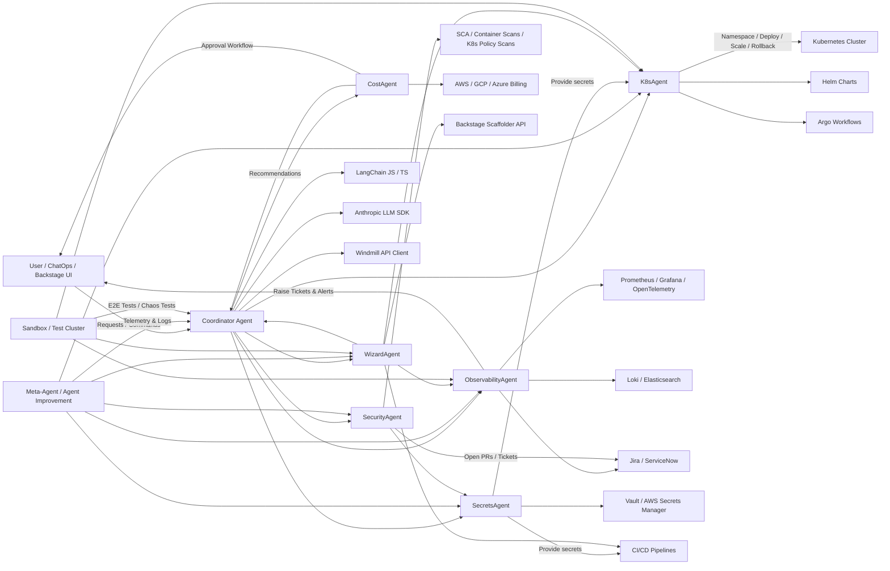
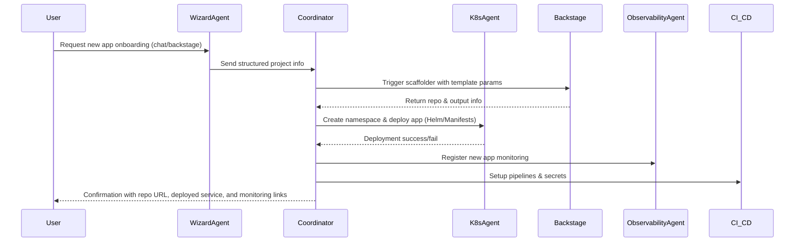
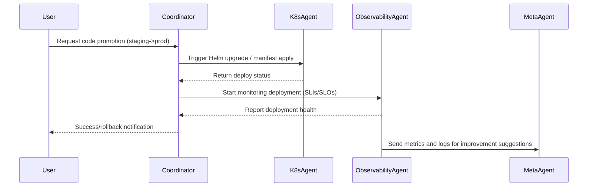
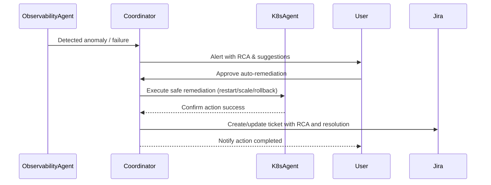
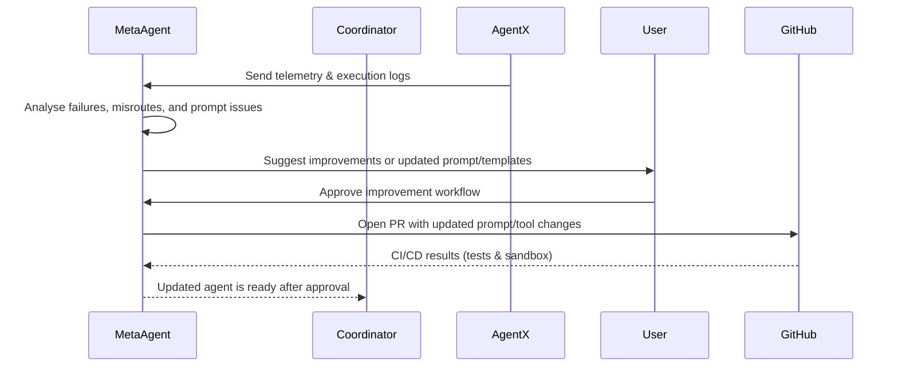

# Comprehensive Agent Architecture Plan for IDP: LangChain + Anthropic + Windmill (TypeScript/JavaScript)

## Architecture Diagram

```mermaid
flowchart TD
    UserPrompt[User Prompt]
    MetaAgent[Meta-Agent (Orchestrator)]
    AgentImprovement[Agent Improvement Agent]
    NewProjectWizard[New Project Wizard Agent]
    K8s[Kubernetes Agent]
    Obs[Observability Agent]
    Secrets[Secrets Management Agent]
    Security[Security Agent]
    Cost[Cost Optimization Agent]
    Compliance[Compliance Agent]
    DevProd[Developer Productivity Agent]
    IncidentSim[Incident Simulation Agent]
    Windmill[Windmill API]

    UserPrompt --> MetaAgent
    MetaAgent --> K8s
    MetaAgent --> Obs
    MetaAgent --> Secrets
    MetaAgent --> Security
    MetaAgent --> Cost
    MetaAgent --> Compliance
    MetaAgent --> DevProd
    MetaAgent --> IncidentSim
    MetaAgent --> NewProjectWizard
    MetaAgent --> AgentImprovement
    K8s --> Windmill
    Obs --> Windmill
    Secrets --> Windmill
    Security --> Windmill
    Cost --> Windmill
    Compliance --> Windmill
    DevProd --> Windmill
    IncidentSim --> Windmill
    NewProjectWizard --> Windmill
    AgentImprovement --> MetaAgent
```



## Sequence diagrams

1️⃣ New App Onboarding



⸻

2️⃣ Code Promotion / Deployment



⸻

3️⃣ Observability Suggestions / Auto-Remediation



⸻

4️⃣ Agent Improvement Suggestions (Meta-Agent)



## ✅ Key Highlights

1. **Agent Communication:** All agents interact through the Coordinator, ensuring safe, auditable execution of platform tasks.
2. **Continuous Improvement:** Observability and Meta-Agent feedback loops enable ongoing auto-remediation and system enhancement.
3. **User Approval & Auditability:** Every critical action requires explicit user approval, with decisions logged for compliance and safety.
4. **Documentation Ready:** All diagrams are Markdown-compatible and can be rendered directly using Mermaid live editors for clear documentation.

---

## Agent Layers & Roles

### 1. Core Agents (Foundation Layer)

These handle day-to-day platform operational tasks:

#### 1.1 Kubernetes Agent

- **Role:** Executes K8s operations (create/update/delete deployments, services, ingress, etc.), manages namespaces/RBAC, schedules pods, enforces policy compliance, cluster health checks, integrates with Helm.
- **Responsibilities:** Accept structured tasks ("scale service-x to 5 replicas"), query metrics for scaling, rollback/redeploy apps on failures.

#### 1.2 Observability Agent

- **Role:** Monitors system/app metrics/logs/traces, informs humans about failures (Slack/Teams/Email), auto-raises tickets (Jira/ServiceNow) with RCA.
- **Responsibilities:** Set alert thresholds dynamically, suggest scale-ups/config changes, pull data from Prometheus/Grafana/OpenTelemetry.

#### 1.3 Secrets Management Agent

- **Role:** Manages platform/app secrets securely, adds/rotates/decommissions secrets.
- **Responsibilities:** Integrate with Vault, AWS Secrets Manager, SOPS; ensure secrets never exposed in logs; validate expiration policies.

#### 1.4 Security Agent

- **Role:** Continuously scans for vulnerabilities in code, containers, dependencies, infra; remediates credential leaks.
- **Responsibilities:** Run dependency scans (Snyk, Trivy, Grype), auto-apply security patches, flag risky RBAC/network policies.

---

## Implementation Code Snippets

### Environment Setup

```sh
mkdir idp-agent-js && cd idp-agent-js
npm init -y
npm install langchain @anthropic-ai/sdk axios dotenv @kubernetes/client-node @octokit/rest
```

Set environment variables in `.env`:

```
ANTHROPIC_API_KEY=your_claude_key
WM_TOKEN=your_windmill_token
WINDMILL_BASE_URL=https://windmill.yourdomain/api
```

### Example: Meta-Agent Orchestration

```typescript
import { ChatAnthropic } from '@langchain/anthropic';
import { initializeAgentExecutorWithOptions } from 'langchain/agents';
import {
  K8sAgentTool,
  ObservabilityAgentTool,
  SecretsAgentTool,
  SecurityAgentTool,
} from './tools';

const metaAgent = await initializeAgentExecutorWithOptions(
  [K8sAgentTool, ObservabilityAgentTool, SecretsAgentTool, SecurityAgentTool],
  new ChatAnthropic({ model: 'claude-3-5-sonnet-20240620', temperature: 0 }),
  { agentType: 'zero-shot-react-description' }
);

// Usage:
const result = await metaAgent.call(
  'Scale service-x to 5 replicas and rotate all secrets.'
);
```

### Example: Core Agent Initialization

```typescript
import { ChatAnthropic } from '@langchain/anthropic';
import { Tool } from 'langchain/tools';
import { runWindmillScript } from '../windmill/windmillClient';

export const K8sAgentTool = new Tool({
  name: 'k8s_agent',
  description: 'Handles Kubernetes operations',
  func: async input => await runWindmillScript('f/platform/k8s_ops', input),
});

export const ObservabilityAgentTool = new Tool({
  name: 'observability_agent',
  description: 'Monitors metrics/logs and raises alerts',
  func: async input =>
    await runWindmillScript('f/platform/observability_ops', input),
});

// ...similar for SecretsAgentTool, SecurityAgentTool, etc.
```

### Example: Tool Definition (Windmill API)

```typescript
import axios from 'axios';
import dotenv from 'dotenv';
dotenv.config();

const windmill = axios.create({
  baseURL: process.env.WINDMILL_BASE_URL,
  headers: { Authorization: `Bearer ${process.env.WM_TOKEN}` },
});

export async function runWindmillScript(path: string, args: object) {
  const res = await windmill.post('/scripts/run', { path, args });
  return res.data;
}
```

### Example: Inter-Agent Communication

```typescript
// Meta-Agent orchestrates requests
const orchestrateTask = async (task: string) => {
  // Reason about which agent(s) to call
  if (task.includes('scale')) {
    return await K8sAgentTool.func({ action: 'scale', ... });
  } else if (task.includes('rotate secret')) {
    return await SecretsAgentTool.func({ action: 'rotate', ... });
  }
  // ...other routing logic
};
```

---

## Specialized & Future Agents

- **Agent Improvement Agent:** Analyzes logs, proposes prompt refinements, tests upgrades in sandbox.
- **New Project Wizard Agent:** Scaffolds new projects with CI/CD, security, monitoring, infra setup.
- **Cost Optimization Agent:** Monitors spend, recommends savings, simulates cost impacts.
- **Compliance Agent:** Ensures deployments meet standards (GDPR, SOC2, ISO27001).
- **Developer Productivity Agent:** Suggests best libraries, coding patterns, tooling.
- **Incident Simulation Agent:** Runs chaos engineering experiments.

---

## Example Folder Structure

```text
idp-agent-js/
├── agents/
│   ├── metaAgent.ts
│   ├── agentImprovementAgent.ts
│   ├── newProjectWizardAgent.ts
│   ├── k8sAgent.ts
│   ├── observabilityAgent.ts
│   ├── secretsAgent.ts
│   ├── securityAgent.ts
│   ├── costAgent.ts
│   ├── complianceAgent.ts
│   ├── developerProductivityAgent.ts
│   └── incidentSimulationAgent.ts
├── tools/
│   ├── k8sTools.ts
│   ├── observabilityTools.ts
│   ├── secretsTools.ts
│   ├── securityTools.ts
│   ├── costTools.ts
│   ├── complianceTools.ts
│   ├── developerProductivityTools.ts
│   └── incidentSimulationTools.ts
├── windmill/
│   └── windmillClient.ts
├── .env
├── package.json
└── README.md
```

---

## Implementation Guide: Capturing and Reviewing Agent Metrics

To enable human-in-the-loop oversight, agents should emit metrics and suggestions that are centrally collected, aggregated, and presented for review and approval. Here’s how to implement this:

### 1. Agent Metrics Emission

Each agent should report relevant metrics and suggestions after task execution. Example:

```typescript
// In each agent's tool definition
const emitMetrics = async (agentName: string, metrics: object) => {
  await runWindmillScript('f/platform/emit_metrics', {
    agent: agentName,
    metrics,
  });
};

// Example usage after a task
const result = await runWindmillScript('f/platform/k8s_ops', input);
await emitMetrics('K8sAgent', { action: input.action, result });
```

### 2. Centralized Metrics Collection

- Use a Windmill script or a dedicated service to collect metrics from all agents.
- Store metrics in a database (e.g., Postgres, MongoDB) or a time-series store (e.g., Prometheus).
- Example Windmill script (Python):

```python
# f/platform/emit_metrics
import os
from pymongo import MongoClient

def main(agent, metrics):
    client = MongoClient(os.environ['MONGODB_URI'])
    db = client['idp_metrics']
    db.metrics.insert_one({'agent': agent, 'metrics': metrics})
```

### 3. Aggregation and Presentation

- Build a Windmill UI, dashboard, or API endpoint to fetch and display metrics grouped by agent, task, or time.
- Example: Windmill script to fetch pending suggestions for review.

```python
# f/platform/fetch_pending_suggestions
from pymongo import MongoClient

def main():
    client = MongoClient(os.environ['MONGODB_URI'])
    db = client['idp_metrics']
    return list(db.metrics.find({'metrics.suggestion': {'$exists': True}, 'metrics.approved': False}))
```

### 4. Human Review and Approval Workflow

- Present suggestions and metrics in a dashboard or send notifications (Slack, email).
- Allow humans to approve/reject suggestions via UI or API.
- Example approval endpoint:

```python
# f/platform/approve_suggestion
from pymongo import MongoClient

def main(suggestion_id, approved):
    client = MongoClient(os.environ['MONGODB_URI'])
    db = client['idp_metrics']
    db.metrics.update_one({'_id': suggestion_id}, {'$set': {'metrics.approved': approved}})
```

- Agents can poll for approvals before executing changes, or the Meta-Agent can orchestrate this step.

### 5. Best Practices

- Standardize metrics format across agents (include agent name, timestamp, action, result, suggestion, approval status).
- Secure metrics storage and access.
- Log all human approvals for audit.
- Optionally, integrate with existing observability tools (Grafana, Kibana) for visualization.

---

## Summary

This architecture enables a modular, autonomous, and self-improving IDP powered by LangChain, Anthropic Claude, and Windmill. Agents are grouped for clarity and extensibility, with clear roles and responsibilities, and a blueprint for implementation in TypeScript/JavaScript. All platform tasks—from K8s ops to cost optimization and incident simulation—can be automated, monitored, and continuously improved.
