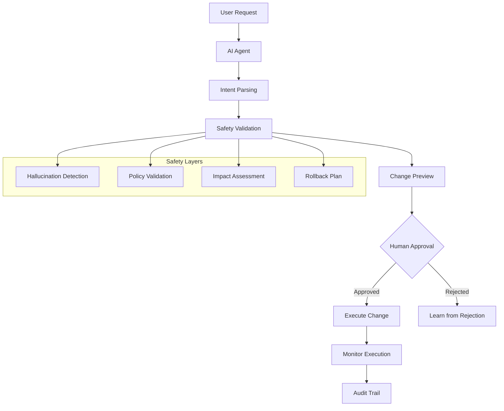

# AI Safety Architecture & Guardrails

## 🛡️ **Zero-Trust AI Safety Framework**

### **Core Principle**: Never trust AI output without human validation for any infrastructure changes



## 🔍 **Multi-Layer Hallucination Prevention**

### **Layer 1: Structured Output Validation**
```python
# Force AI to use structured responses only
from pydantic import BaseModel, validator
from typing import Literal, List, Optional

class PlatformAction(BaseModel):
    """Structured AI response - prevents hallucinated commands"""
    action_type: Literal["deploy", "scale", "delete", "modify", "info"]
    resource_type: Literal["application", "database", "storage", "network"]
    target_environment: Literal["development", "staging", "production"]
    resource_name: str
    parameters: dict
    risk_level: Literal["low", "medium", "high", "critical"]
    estimated_impact: str
    rollback_plan: str
    
    @validator('resource_name')
    def validate_resource_exists(cls, v):
        """Ensure resource actually exists"""
        if not resource_exists_in_cluster(v):
            raise ValueError(f"Resource {v} does not exist")
        return v
    
    @validator('action_type')
    def validate_action_allowed(cls, v, values):
        """Check if action is allowed on this resource type"""
        allowed_actions = get_allowed_actions(values.get('resource_type'))
        if v not in allowed_actions:
            raise ValueError(f"Action {v} not allowed on {values.get('resource_type')}")
        return v

# AI must respond with this exact structure
def get_ai_response(user_input: str) -> PlatformAction:
    """Force AI to respond in structured format only"""
    
    system_prompt = """
    You are a platform engineering assistant. You must ONLY respond with valid JSON 
    matching the PlatformAction schema. Never invent resources, commands, or 
    capabilities that don't exist.
    
    If you're unsure about anything, set risk_level to "high" and ask for clarification.
    
    Available actions: deploy, scale, delete, modify, info
    Available resource types: application, database, storage, network
    Available environments: development, staging, production
    
    Before suggesting any action, verify the resource exists and the action is valid.
    """
    
    response = openai.chat.completions.create(
        model="gpt-4",
        messages=[
            {"role": "system", "content": system_prompt},
            {"role": "user", "content": user_input}
        ],
        functions=[{
            "name": "platform_action",
            "description": "Execute platform action",
            "parameters": PlatformAction.schema()
        }],
        function_call={"name": "platform_action"}
    )
    
    # Parse and validate AI response
    try:
        ai_output = json.loads(response.choices[0].message.function_call.arguments)
        validated_action = PlatformAction(**ai_output)
        return validated_action
    except Exception as e:
        raise AIHallucinationError(f"AI provided invalid response: {e}")
```

### **Layer 2: Reality Check Validation**
```python
class RealityCheckValidator:
    """Validate AI suggestions against actual platform state"""
    
    def __init__(self, k8s_client, aws_client):
        self.k8s = k8s_client
        self.aws = aws_client
        
    def validate_action(self, action: PlatformAction) -> ValidationResult:
        """Check if AI suggestion makes sense in current context"""
        
        checks = []
        
        # Check 1: Resource exists
        if not self.resource_exists(action.resource_name, action.resource_type):
            checks.append(ValidationCheck(
                check="resource_exists",
                passed=False,
                error=f"Resource {action.resource_name} does not exist",
                severity="critical"
            ))
        
        # Check 2: Action is technically possible
        if not self.action_possible(action):
            checks.append(ValidationCheck(
                check="action_possible", 
                passed=False,
                error=f"Action {action.action_type} not possible on {action.resource_name}",
                severity="critical"
            ))
        
        # Check 3: Parameters are valid
        param_validation = self.validate_parameters(action)
        if not param_validation.valid:
            checks.append(ValidationCheck(
                check="parameters_valid",
                passed=False,
                error=f"Invalid parameters: {param_validation.errors}",
                severity="high"
            ))
        
        # Check 4: No hallucinated capabilities
        if self.has_hallucinated_capabilities(action):
            checks.append(ValidationCheck(
                check="no_hallucination",
                passed=False,
                error="AI suggested non-existent capabilities",
                severity="critical"
            ))
        
        return ValidationResult(
            valid=all(check.passed for check in checks),
            checks=checks,
            overall_risk=self.calculate_risk_level(checks, action)
        )
    
    def has_hallucinated_capabilities(self, action: PlatformAction) -> bool:
        """Check if AI hallucinated capabilities we don't have"""
        
        # Known platform capabilities
        valid_capabilities = {
            "deploy": ["kubernetes", "docker", "github"],
            "scale": ["horizontal", "vertical"],
            "database": ["postgresql", "mysql", "redis"],
            "storage": ["s3", "ebs"]
        }
        
        # Check if AI suggested something we can't do
        for param_key, param_value in action.parameters.items():
            if param_key in valid_capabilities:
                if param_value not in valid_capabilities[param_key]:
                    return True
                    
        return False
```

### **Layer 3: Policy and Compliance Validation**
```python
class PolicyValidator:
    """Ensure AI suggestions comply with organizational policies"""
    
    def __init__(self, policy_engine):
        self.policies = policy_engine
        
    def validate_compliance(self, action: PlatformAction, user_context: dict) -> PolicyResult:
        """Check action against all organizational policies"""
        
        violations = []
        
        # Security policies
        security_check = self.validate_security_policies(action, user_context)
        if security_check.violations:
            violations.extend(security_check.violations)
        
        # RBAC policies
        rbac_check = self.validate_rbac(action, user_context)
        if not rbac_check.allowed:
            violations.append(PolicyViolation(
                policy="rbac",
                rule=rbac_check.violated_rule,
                severity="critical",
                message=f"User {user_context['user']} not authorized for {action.action_type}"
            ))
        
        # Environment policies
        env_check = self.validate_environment_policies(action)
        if env_check.violations:
            violations.extend(env_check.violations)
        
        # Resource limits
        resource_check = self.validate_resource_limits(action)
        if resource_check.violations:
            violations.extend(resource_check.violations)
        
        return PolicyResult(
            compliant=len(violations) == 0,
            violations=violations,
            required_approvals=self.get_required_approvals(violations, action)
        )
```

## ✅ **Human Approval Workflows**

### **Risk-Based Approval Matrix**
```python
class ApprovalWorkflow:
    """Route actions through appropriate approval workflows"""
    
    APPROVAL_MATRIX = {
        "low": {
            "auto_approve": True,
            "required_approvers": 0,
            "notification_only": True
        },
        "medium": {
            "auto_approve": False,
            "required_approvers": 1,
            "allowed_approvers": ["developer", "senior_developer", "team_lead"]
        },
        "high": {
            "auto_approve": False,
            "required_approvers": 2,
            "allowed_approvers": ["senior_developer", "team_lead", "sre"]
        },
        "critical": {
            "auto_approve": False,
            "required_approvers": 3,
            "allowed_approvers": ["team_lead", "sre", "platform_admin"],
            "require_sre": True
        }
    }
    
    def create_approval_request(self, action: PlatformAction, user_context: dict) -> ApprovalRequest:
        """Create human approval request with full context"""
        
        approval_config = self.APPROVAL_MATRIX[action.risk_level]
        
        # Create detailed preview of what will happen
        change_preview = self.generate_change_preview(action)
        
        # Create approval request
        approval_request = ApprovalRequest(
            id=str(uuid.uuid4()),
            action=action,
            requested_by=user_context["user"],
            requested_at=datetime.now(),
            risk_level=action.risk_level,
            required_approvers=approval_config["required_approvers"],
            allowed_approvers=approval_config["allowed_approvers"],
            change_preview=change_preview,
            rollback_plan=action.rollback_plan,
            expiry_time=datetime.now() + timedelta(hours=24)
        )
        
        # Store in approval queue
        self.store_approval_request(approval_request)
        
        # Notify approvers
        self.notify_approvers(approval_request)
        
        return approval_request
    
    def generate_change_preview(self, action: PlatformAction) -> ChangePreview:
        """Generate detailed preview of what will change"""
        
        current_state = self.get_current_state(action.resource_name)
        predicted_state = self.predict_post_change_state(action, current_state)
        
        return ChangePreview(
            current_state=current_state,
            predicted_state=predicted_state,
            diff=self.generate_diff(current_state, predicted_state),
            affected_resources=self.identify_affected_resources(action),
            estimated_downtime=self.estimate_downtime(action),
            cost_impact=self.estimate_cost_impact(action)
        )
```

### **Interactive Approval Interface**
```python
# Slack/Teams approval interface
class ApprovalInterface:
    """Interactive approval interface for humans"""
    
    def send_approval_request(self, approval_request: ApprovalRequest):
        """Send rich approval request to humans"""
        
        slack_message = {
            "text": f"🤖 AI Platform Request Approval Needed",
            "blocks": [
                {
                    "type": "header",
                    "text": {
                        "type": "plain_text",
                        "text": f"🚨 {approval_request.risk_level.upper()} Risk Platform Change"
                    }
                },
                {
                    "type": "section",
                    "fields": [
                        {"type": "mrkdwn", "text": f"*Action:* {approval_request.action.action_type}"},
                        {"type": "mrkdwn", "text": f"*Resource:* {approval_request.action.resource_name}"},
                        {"type": "mrkdwn", "text": f"*Environment:* {approval_request.action.target_environment}"},
                        {"type": "mrkdwn", "text": f"*Requested by:* {approval_request.requested_by}"}
                    ]
                },
                {
                    "type": "section",
                    "text": {
                        "type": "mrkdwn",
                        "text": f"*What will change:*\n```\n{approval_request.change_preview.diff}\n```"
                    }
                },
                {
                    "type": "section",
                    "text": {
                        "type": "mrkdwn",
                        "text": f"*Impact:* {approval_request.action.estimated_impact}"
                    }
                },
                {
                    "type": "section",
                    "text": {
                        "type": "mrkdwn",
                        "text": f"*Rollback plan:* {approval_request.action.rollback_plan}"
                    }
                },
                {
                    "type": "actions",
                    "elements": [
                        {
                            "type": "button",
                            "text": {"type": "plain_text", "text": "✅ Approve"},
                            "style": "primary",
                            "action_id": f"approve_{approval_request.id}"
                        },
                        {
                            "type": "button", 
                            "text": {"type": "plain_text", "text": "❌ Reject"},
                            "style": "danger",
                            "action_id": f"reject_{approval_request.id}"
                        },
                        {
                            "type": "button",
                            "text": {"type": "plain_text", "text": "📋 View Details"},
                            "action_id": f"details_{approval_request.id}"
                        }
                    ]
                }
            ]
        }
        
        self.slack_client.chat_postMessage(
            channel="#platform-approvals",
            **slack_message
        )
    
    def handle_approval_response(self, action_id: str, user_id: str, response_data: dict):
        """Handle human approval/rejection"""
        
        approval_id = action_id.split("_")[1]
        action_type = action_id.split("_")[0]
        
        approval_request = self.get_approval_request(approval_id)
        
        if action_type == "approve":
            result = self.process_approval(approval_request, user_id, response_data)
        elif action_type == "reject":
            result = self.process_rejection(approval_request, user_id, response_data)
        elif action_type == "details":
            result = self.show_detailed_view(approval_request)
        
        return result
```

## 📊 **Comprehensive Audit Trail**

### **Audit Architecture**
```python
class AuditLogger:
    """Comprehensive audit logging for all AI interactions"""
    
    def __init__(self, audit_db, compliance_requirements):
        self.audit_db = audit_db
        self.compliance = compliance_requirements
        
    def log_ai_interaction(self, interaction: AIInteraction):
        """Log every AI interaction with full context"""
        
        audit_record = AuditRecord(
            timestamp=datetime.now(),
            interaction_id=str(uuid.uuid4()),
            user_id=interaction.user_id,
            user_input=interaction.user_input,
            ai_response=interaction.ai_response,
            ai_model_version=interaction.model_version,
            validation_results=interaction.validation_results,
            human_approval_status=interaction.approval_status,
            executed_actions=interaction.executed_actions,
            execution_results=interaction.execution_results,
            rollback_actions=interaction.rollback_actions,
            security_context=interaction.security_context,
            compliance_tags=self.compliance.get_tags(interaction)
        )
        
        # Store in audit database
        self.audit_db.store_record(audit_record)
        
        # Send to compliance systems if required
        if self.compliance.requires_external_audit(interaction):
            self.send_to_compliance_system(audit_record)
        
        # Real-time monitoring for suspicious patterns
        self.check_for_anomalies(audit_record)
    
    def log_approval_workflow(self, approval_request: ApprovalRequest, outcome: ApprovalOutcome):
        """Log approval workflow details"""
        
        approval_audit = ApprovalAudit(
            approval_id=approval_request.id,
            requested_action=approval_request.action,
            requested_by=approval_request.requested_by,
            requested_at=approval_request.requested_at,
            approvers=outcome.approvers,
            approval_times=outcome.approval_times,
            final_decision=outcome.decision,
            decision_rationale=outcome.rationale,
            policy_violations=outcome.policy_violations
        )
        
        self.audit_db.store_approval_audit(approval_audit)
    
    def generate_audit_report(self, time_period: str, filters: dict = None) -> AuditReport:
        """Generate comprehensive audit reports"""
        
        records = self.audit_db.query_records(time_period, filters)
        
        return AuditReport(
            period=time_period,
            total_interactions=len(records),
            ai_accuracy_rate=self.calculate_accuracy_rate(records),
            approval_rates_by_risk=self.calculate_approval_rates(records),
            most_common_actions=self.get_common_actions(records),
            security_incidents=self.identify_security_incidents(records),
            compliance_status=self.check_compliance_status(records),
            recommendations=self.generate_recommendations(records)
        )
```

### **Audit Dashboard Example**
```yaml
Audit Dashboard Widgets:

Real-time Monitoring:
  - AI interactions per hour
  - Approval queue status  
  - Failed validations
  - Security alerts

Historical Analysis:
  - AI accuracy trends
  - Approval time distributions
  - User adoption patterns
  - Risk level distributions

Compliance Reporting:
  - SOC2 audit trail completeness
  - GDPR data handling compliance
  - Change management compliance
  - Security policy violations

Operational Insights:
  - Most requested operations
  - Common AI failure modes
  - Approval bottlenecks
  - User satisfaction trends
```

## 🚨 **Safety Mechanisms in Action**

### **Example: AI Hallucinates a Dangerous Command**
```python
# Scenario: AI suggests deleting production database
user_input = "Clean up my database"
ai_response = PlatformAction(
    action_type="delete",
    resource_type="database", 
    target_environment="production",  # AI hallucinated this!
    resource_name="user-data-prod",
    parameters={"force": True},  # AI hallucinated dangerous parameter!
    risk_level="low"  # AI incorrectly assessed risk!
)

# Safety Layer 1: Structured validation catches issues
validator = RealityCheckValidator(k8s_client, aws_client)
validation_result = validator.validate_action(ai_response)

# Results in:
ValidationResult(
    valid=False,
    checks=[
        ValidationCheck(
            check="risk_assessment",
            passed=False,
            error="Deleting production database should be CRITICAL risk, not low",
            severity="critical"
        ),
        ValidationCheck(
            check="parameter_safety",
            passed=False, 
            error="Force delete parameter not allowed without explicit approval",
            severity="critical"
        )
    ]
)

# Safety Layer 2: Policy validation blocks action
policy_validator = PolicyValidator(policy_engine)
policy_result = policy_validator.validate_compliance(ai_response, user_context)

# Results in:
PolicyResult(
    compliant=False,
    violations=[
        PolicyViolation(
            policy="data_protection",
            rule="no_production_db_delete_without_dba_approval",
            severity="critical"
        )
    ]
)

# Outcome: Action blocked, user notified of safety concerns
response_to_user = """
❌ I cannot execute this request for safety reasons:

🚨 Critical Issues Detected:
- Deleting production database requires DBA approval
- Force delete parameter is dangerous and not allowed
- Risk level incorrectly assessed

✅ Safe Alternative:
Instead, I can help you:
1. Clean up development/staging databases
2. Archive old data in production (with approval)
3. Optimize database performance

Would you like me to suggest a safer approach?
"""
```

### **Example: Safe Operation with Human Oversight**
```python
# Scenario: Safe deployment with proper approval
user_input = "Deploy my user-service to staging"
ai_response = PlatformAction(
    action_type="deploy",
    resource_type="application",
    target_environment="staging",
    resource_name="user-service",
    parameters={"replicas": 3, "memory": "512Mi"},
    risk_level="medium",
    estimated_impact="Staging deployment, no production impact",
    rollback_plan="kubectl rollout undo deployment/user-service"
)

# Safety Layer 1: Passes validation
validation_result = validator.validate_action(ai_response)  # ✅ Valid

# Safety Layer 2: Requires approval for medium risk
approval_request = approval_workflow.create_approval_request(ai_response, user_context)

# Approval sent to team lead via Slack
# Team lead approves after reviewing change preview

# Safety Layer 3: Execution with monitoring
execution_result = execute_with_monitoring(ai_response, approval_request)

# Safety Layer 4: Complete audit trail
audit_logger.log_ai_interaction(AIInteraction(
    user_input=user_input,
    ai_response=ai_response,
    validation_results=validation_result,
    approval_status="approved",
    execution_results=execution_result
))
```

## 🎯 **Implementation Priority**

### **Phase 1: Basic Safety (Week 1-2)**
```python
Essential Safety Features:
1. Structured AI responses only (no free-form dangerous commands)
2. Human approval for ALL infrastructure changes
3. Basic audit logging of every interaction
4. Simple rollback mechanisms

Minimum Viable Safety:
- AI can only suggest, never execute
- Every suggestion requires explicit human approval
- All interactions logged with full context
- Clear "reject and explain why" option
```

### **Phase 2: Advanced Validation (Week 3-4)**  
```python
Enhanced Safety Features:
1. Reality check validation (does resource exist?)
2. Policy compliance checking
3. Risk-based approval workflows
4. Rich approval interfaces (Slack, web)

Improved Safety:
- AI suggestions validated against actual platform state
- Automatic policy compliance checking
- Different approval requirements based on risk
- Interactive approval with change previews
```

### **Phase 3: Comprehensive Auditing (Week 5-6)**
```python
Full Audit and Compliance:
1. Comprehensive audit trails for compliance
2. Real-time anomaly detection
3. Automated compliance reporting
4. Advanced rollback and recovery

Enterprise Safety:
- SOC2/GDPR compliant audit trails
- Automated security incident detection
- Advanced approval workflows
- Complete change management integration
```

This approach ensures that **every AI interaction is safe, auditable, and requires explicit human approval** for any infrastructure changes, while still providing the revolutionary developer experience of natural language platform management.

