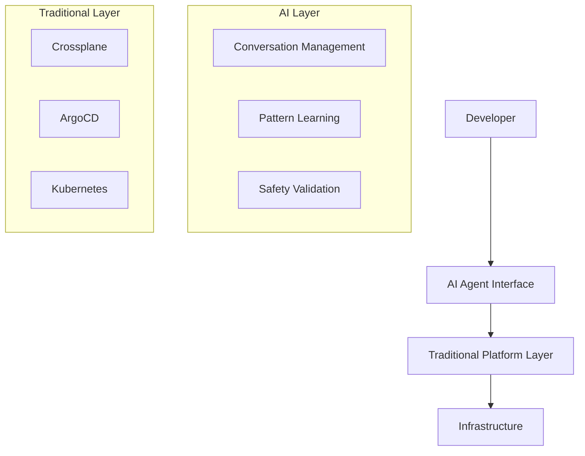

# Architecture Decision Records (ADRs) - AI-Powered IDP

## ADR-001: AI-Agent-First Platform Strategy

**Date**: 2024-08-16  
**Status**: Accepted  
**Deciders**: Platform Engineering Team, AI/ML Team, Executive Leadership

### Context
Traditional Internal Developer Platforms suffer from low adoption rates (10-30%), steep learning curves, and require developers to understand complex abstractions. We need to decide whether to build a traditional IDP or pioneer an AI-agent-first approach.

### Decision
We will build an **AI-agent-first platform** where the AI agent is the primary interface, not just a helper feature.

### Rationale
- **Market Differentiation**: 10x improvement vs incremental gains of traditional IDPs
- **Developer Experience**: Natural language eliminates learning curve entirely
- **Adoption Rates**: Target 80-95% adoption vs 10-30% typical for traditional IDPs
- **Organizational Learning**: AI learns company-specific patterns automatically
- **Competitive Moat**: AI capabilities create defensible technological advantage

### Consequences
**Positive:**
- Revolutionary developer experience improvement
- Market-leading competitive differentiation
- Self-improving platform through machine learning
- Natural language eliminates training requirements

**Negative:**
- Higher initial complexity and technical risk
- Dependency on AI model accuracy and reliability
- Need for AI/ML expertise on team
- Longer initial development timeline

**Mitigation:**
- Hybrid approach with traditional fallback options
- Extensive testing and validation of AI decisions
- Gradual rollout with feedback loops
- Investment in AI safety and reliability measures

---

## ADR-002: LangChain + Windmill Architecture

**Date**: 2024-08-16  
**Status**: Accepted  
**Deciders**: AI/ML Engineering Team, Platform Engineering Team

### Context
We need to select the technology stack for building the AI agent that can understand natural language, maintain conversation context, and execute platform operations safely.

### Decision
We will use **LangChain for AI agent logic** and **Windmill for workflow execution**.

### Rationale
**LangChain Benefits:**
- Purpose-built for conversational AI agents
- Excellent memory management and context retention
- Tool integration framework for platform operations
- Active community and ecosystem
- Support for multiple LLM providers

**Windmill Benefits:**
- Workflow-as-code with strong typing
- Built-in versioning and rollback capabilities
- Secure execution environment
- Visual workflow editor for debugging
- Multi-language support (Python, TypeScript, SQL)

### Consequences
**Positive:**
- Rapid development of conversational AI capabilities
- Safe and auditable workflow execution
- Strong separation between AI logic and platform operations
- Excellent debugging and monitoring capabilities

**Negative:**
- Learning curve for both technologies
- Dependency on external frameworks
- Potential performance overhead

**Mitigation:**
- Team training on LangChain and Windmill
- Development of internal expertise
- Performance monitoring and optimization
- Fallback mechanisms for critical operations

---

## ADR-003: Organizational Pattern Learning Strategy

**Date**: 2024-08-16  
**Status**: Accepted  
**Deciders**: AI/ML Team, Platform Engineering Team

### Context
The AI agent needs to learn from organizational deployments and patterns to provide intelligent, context-aware recommendations that improve over time.

### Decision
We will implement **automated pattern recognition** using machine learning to learn from deployment outcomes and organizational preferences.

### Rationale
- **Continuous Improvement**: Platform gets smarter with each deployment
- **Organization-Specific**: Learns company culture and preferences
- **Anti-Pattern Detection**: Warns against known problematic configurations
- **Success Pattern Replication**: Applies proven patterns to new scenarios

### Implementation Strategy
```python
Pattern Learning Components:
1. Feature Extraction: Deployment configurations → ML features
2. Outcome Correlation: Success/failure metrics → Pattern validation
3. Clustering Analysis: Group similar successful deployments
4. Recommendation Engine: Suggest optimal configurations
5. Feedback Loop: Learn from user acceptance/rejection
```

### Consequences
**Positive:**
- Platform intelligence improves automatically
- Personalized recommendations per team/project
- Reduced risk through proven pattern application
- Organizational knowledge preservation

**Negative:**
- Initial cold-start problem with no historical data
- ML model complexity and maintenance requirements
- Potential bias in learned patterns

**Mitigation:**
- Seed with industry best practices initially
- Implement explainable AI for pattern recommendations
- Regular model retraining and bias detection
- Human override capabilities for all recommendations

---

## ADR-004: Safety-First AI Operations

**Date**: 2024-08-16  
**Status**: Accepted  
**Deciders**: Security Team, Platform Engineering Team, AI/ML Team

### Context
AI agents executing infrastructure operations pose significant safety and security risks. We need comprehensive safety measures to prevent destructive actions and ensure reliable operations.

### Decision
We will implement **multi-layer safety validation** with human-in-the-loop for destructive operations.

### Safety Architecture
```yaml
Safety Layers:
1. Input Validation: Validate user requests before processing
2. Intent Classification: Ensure AI understands request correctly  
3. Impact Assessment: Analyze potential consequences of operations
4. Policy Enforcement: Apply security and compliance rules
5. Human Approval: Require confirmation for high-risk operations
6. Execution Monitoring: Real-time monitoring during execution
7. Automatic Rollback: Rollback on failure or anomaly detection
8. Audit Logging: Complete trail of all decisions and actions
```

### Safety Categories
```yaml
Automatic Execution: Low-risk operations (deploy to dev, scale up)
AI Recommendation + Human Approval: Medium-risk (production deploy)
Human Required: High-risk operations (delete database, scale down prod)
Blocked Operations: Destructive actions without approval workflow
```

### Consequences
**Positive:**
- High confidence in AI operation safety
- Comprehensive audit trail for compliance
- Gradual trust building through proven reliability
- Learning from safety incidents to improve

**Negative:**
- Reduced speed for some operations requiring approval
- Complexity in safety system implementation
- Potential false positives blocking legitimate operations

**Mitigation:**
- Intelligent risk assessment to minimize false positives
- Fast-track approval processes for trusted operations
- Continuous improvement of safety models
- Clear escalation paths for blocked operations

---

## ADR-005: Hybrid Traditional + AI Architecture

**Date**: 2024-08-16  
**Status**: Accepted  
**Deciders**: Platform Engineering Team, Architecture Team

### Context
While building an AI-first platform, we still need traditional platform components (Kubernetes, Crossplane, ArgoCD) for infrastructure management. We need to decide how to integrate AI with existing platform patterns.

### Decision
We will use **AI agent as orchestrator** of traditional platform components, not as replacement.

### Integration Strategy
```yaml
AI Agent Role: Primary interface and intelligent orchestrator
Traditional Components: Execution layer managed by AI

Component Integration:
- Crossplane: AI generates compositions based on learned patterns
- ArgoCD: AI creates and manages applications with intelligent strategies  
- Kubernetes: AI applies configurations with organizational optimizations
- Monitoring: AI interprets data for proactive recommendations
```

### Architecture Layers


### Consequences
**Positive:**
- Leverage proven platform engineering patterns
- AI adds intelligence without reinventing infrastructure
- Gradual migration path from traditional to AI-powered
- Fallback to traditional interfaces when needed

**Negative:**
- Increased complexity managing both AI and traditional layers
- Potential inconsistencies between AI and traditional interfaces
- Learning curve for team on both approaches

**Mitigation:**
- Clear interface contracts between AI and traditional layers
- Comprehensive testing of AI-traditional integration
- Documentation for both AI and traditional usage patterns
- Monitoring for inconsistencies and drift

---

## ADR-006: Multi-Interface AI Agent Strategy

**Date**: 2024-08-16  
**Status**: Accepted  
**Deciders**: UX Design Team, AI/ML Team, Platform Engineering Team

### Context
Developers have different preferences for interfaces (chat, IDE, Slack, voice). We need to decide whether to focus on one interface or support multiple interaction methods.

### Decision
We will build **multi-interface AI agent** with consistent conversation context across all interfaces.

### Interface Strategy
```yaml
Primary Interfaces:
1. Web Chat: Rich interface with visual elements
2. Slack Integration: Team collaboration context
3. IDE Extensions: Integrated development workflow
4. Voice Commands: Hands-free operations

Shared Components:
- Conversation Context: Maintained across all interfaces
- AI Agent Core: Same intelligence for all interfaces
- Safety Validation: Consistent safety across interfaces
- Learning System: Learns from all interaction patterns
```

### Implementation Approach
```python
# Unified Agent Interface
class MultiInterfaceAgent:
    def __init__(self):
        self.core_agent = LangChainAgent()
        self.context_manager = ConversationContext()
        
    def process_request(self, 
                       message: str, 
                       interface: str, 
                       user_context: dict):
        # Unified processing regardless of interface
        response = self.core_agent.process(
            message, 
            context=self.context_manager.get_context(user_context),
            interface_capabilities=self.get_interface_capabilities(interface)
        )
        
        # Format response for specific interface
        return self.format_for_interface(response, interface)
```

### Consequences
**Positive:**
- Meet developers where they prefer to work
- Consistent experience across all interfaces
- Broader adoption through interface choice
- Rich context from multiple interaction points

**Negative:**
- Increased development and maintenance complexity
- Interface-specific capabilities and limitations
- Testing complexity across multiple interfaces

**Mitigation:**
- Shared core agent logic to reduce duplication
- Interface abstraction layer for consistent behavior
- Comprehensive testing strategy for all interfaces
- Gradual rollout starting with primary interfaces

---

## ADR-007: Proactive vs Reactive AI Strategy

**Date**: 2024-08-16  
**Status**: Accepted  
**Deciders**: AI/ML Team, Platform Engineering Team, Product Team

### Context
We need to decide whether the AI agent should only respond to user requests (reactive) or proactively identify opportunities and issues (proactive).

### Decision
We will implement **proactive AI capabilities** with user-controlled notification preferences.

### Proactive Capabilities
```yaml
Cost Optimization:
- Identify unused resources for cleanup
- Suggest right-sizing based on usage patterns
- Recommend reserved instance purchases
- Alert on budget threshold breaches

Performance Optimization:
- Detect performance degradation trends
- Suggest caching strategies
- Recommend database optimization
- Alert on SLA threshold risks

Security Enhancement:
- Identify security policy violations
- Suggest vulnerability remediation
- Alert on compliance drift
- Recommend security improvements

Operational Intelligence:
- Predict scaling needs based on trends
- Suggest preventive maintenance
- Alert on potential issues before they occur
- Recommend operational improvements
```

### User Control Framework
```yaml
Notification Preferences:
- Frequency: Real-time, daily, weekly summaries
- Severity: Critical only, warnings included, all insights
- Categories: Cost, performance, security, operations
- Delivery: Chat, email, Slack, dashboard

Auto-execution Permissions:
- Safe optimizations: Auto-apply with notification
- Medium-risk changes: Suggest with one-click approval
- High-risk changes: Require explicit approval
- No-go operations: Always require manual execution
```

### Consequences
**Positive:**
- Continuous value delivery without user requests
- Prevention of issues before they impact users
- Automatic optimization improves platform efficiency
- Educational value helps users learn best practices

**Negative:**
- Risk of notification fatigue if not properly managed
- Potential for unwanted automated changes
- Complexity in determining when to be proactive

**Mitigation:**
- Smart notification batching and prioritization
- Clear user control over proactive behaviors
- Gradual rollout of proactive features
- Feedback loops to improve proactive timing and relevance

---

## ADR-008: Enterprise vs Developer-First Features

**Date**: 2024-08-16  
**Status**: Accepted  
**Deciders**: Product Team, Engineering Leadership, Sales Team

### Context
We need to balance features that appeal to individual developers versus enterprise requirements for compliance, security, and management.

### Decision
We will prioritize **developer experience first** while building enterprise features that are invisible to developers.

### Feature Prioritization
```yaml
Developer-First Features (Phase 1):
- Natural language interface
- Instant deployment capabilities
- Intelligent troubleshooting
- Performance optimization suggestions
- Cost awareness and optimization

Enterprise Features (Built-in, Invisible):
- Comprehensive audit logging
- RBAC and access controls
- Compliance policy enforcement
- Multi-tenancy support
- Enterprise SSO integration

Enterprise Features (Phase 2):
- Advanced analytics and reporting
- Custom policy frameworks
- Enterprise support and SLAs
- Advanced security features
- Integration with enterprise tools
```

### Developer Experience Principles
```yaml
Simplicity: Complex enterprise features hidden from developers
Productivity: Features that directly improve development speed
Learning: AI helps developers learn best practices naturally
Choice: Multiple interfaces and interaction methods
Safety: Guardrails that prevent issues without blocking work
```

### Enterprise Integration Strategy
```yaml
Invisible Integration: Enterprise requirements met without developer impact
Policy Enforcement: Automatic application of compliance requirements
Audit Trail: Complete visibility for enterprise administrators
Customization: Enterprise-specific patterns and policies
Support: Enterprise-grade support and SLAs
```

### Consequences
**Positive:**
- High developer adoption through excellent experience
- Enterprise requirements met without compromising developer productivity
- Platform grows organically through developer satisfaction
- Clear upgrade path from developer to enterprise features

**Negative:**
- Potential complexity in balancing competing requirements
- Risk of enterprise features impacting developer experience
- Need for sophisticated feature flagging and configuration

**Mitigation:**
- Strict separation of developer and enterprise concerns
- Extensive user testing to ensure enterprise features remain invisible
- Clear product roadmap balancing both constituencies
- Regular feedback from both developers and enterprise stakeholders

---

## Template for New ADRs

```markdown
## ADR-XXX: [Title]

**Date**: YYYY-MM-DD  
**Status**: [Proposed | Accepted | Deprecated | Superseded]  
**Deciders**: [List of people involved in decision]

### Context
[Describe the issue motivating this decision, especially as it relates to AI-powered platform strategy]

### Decision
[State the decision clearly, including AI/ML considerations]

### Rationale
[Explain why this decision was made, including AI-specific benefits]

### Implementation Strategy
[Technical approach for implementation, including AI components]

### Consequences
**Positive:**
- [List positive outcomes]

**Negative:**
- [List negative outcomes]

**Mitigation:**
- [How to address negative consequences]

**AI-Specific Considerations:**
- [Any special considerations for AI/ML components]
```Status**: Accepted  
**Deciders**: Platform Engineering Team

### Context
We need a local development strategy that provides environment parity while being cost-effective and easy to set up.

### Decision
We will use **Local Kubernetes + LocalStack** for local development rather than cloud-based development environments.

### Rationale
- **Cost Efficiency**: No cloud costs for individual developer environments
- **Environment Parity**: Same Crossplane patterns work locally and in cloud
- **Fast Iteration**: Quick feedback loops for platform development
- **Offline Capability**: Developers can work without internet connectivity
- **Resource Control**: Developers control their own environment

### Consequences
**Positive:**
- Zero cloud costs for development
- Fast iteration cycles
- Complete developer control
- Environment consistency

**Negative:**
- Local resource requirements
- Potential differences from cloud environments
- Setup complexity for new developers

**Mitigation:**
- Automated setup scripts
- Documentation and training
- Cloud development option for complex scenarios

---

## ADR-007: Monitoring and Observability Stack

**Date**: 2024-08-16  
**Status**: Accepted  
**Deciders**: Platform Engineering Team, SRE Team

### Context
We need comprehensive observability across our multi-cluster platform including metrics, logs, and traces.

### Decision
We will use **Prometheus + Grafana + Jaeger + Cilium Hubble** for our observability stack.

### Rationale
- **Kubernetes Native**: Well-integrated with Kubernetes ecosystem
- **Open Source**: No vendor lock-in with established tools
- **Cilium Integration**: Hubble provides network-level observability
- **Community Support**: Large community and ecosystem
- **Cost Effective**: No per-metric pricing like SaaS solutions

### Consequences
**Positive:**
- Complete observability coverage
- Cost-effective solution
- Strong integration with platform
- Customizable dashboards and alerts

**Negative:**
- Operational overhead for managing stack
- Storage and retention management
- Learning curve for team

**Mitigation:**
- Automated deployment and management
- Retention policies and storage optimization
- Training and documentation

---

## Template for New ADRs

```markdown
## ADR-XXX: [Title]

**Date**: YYYY-MM-DD  
**Status**: [Proposed | Accepted | Deprecated | Superseded]  
**Deciders**: [List of people involved in decision]

### Context
[Describe the issue motivating this decision]

### Decision
[State the decision clearly]

### Rationale
[Explain why this decision was made]

### Consequences
**Positive:**
- [List positive outcomes]

**Negative:**
- [List negative outcomes]

**Mitigation:**
- [How to address negative consequences]
```