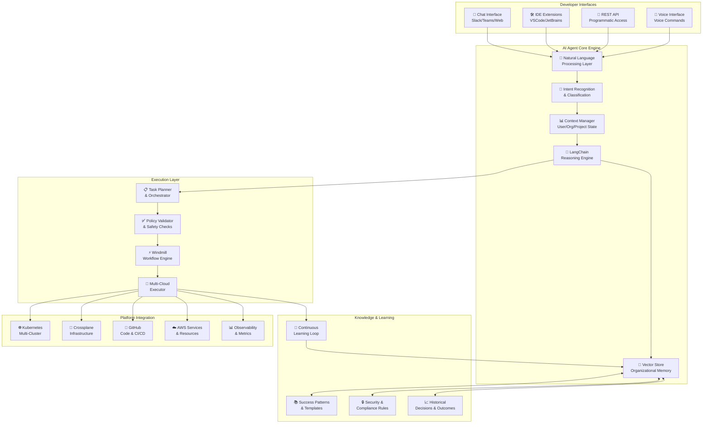
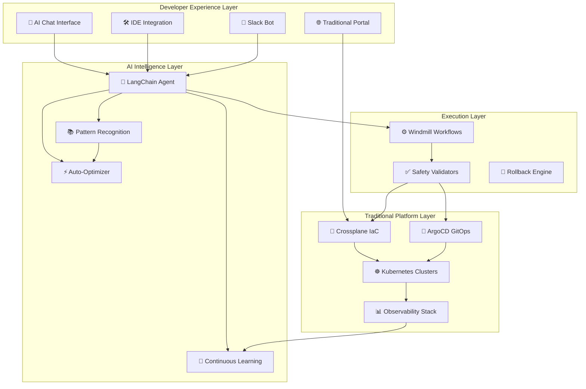

# AI-Powered Integrated Developer Platform (IDP) - Comprehensive Project Documentation

## Executive Summary

This document outlines the development of a revolutionary AI-powered Integrated Developer Platform that uses LangChain and Windmill to create an intelligent agent capable of understanding natural language requests, learning organizational patterns, and autonomously managing infrastructure and deployments.

**Revolutionary Approach:**
- **AI-Agent-First**: The AI agent is the primary interface, not just a helper
- **Self-Learning Platform**: Continuously improves from organizational usage patterns
- **Natural Language Operations**: Developers describe what they want, AI figures out how
- **Autonomous Optimization**: AI proactively optimizes costs, security, and performance

**Competitive Differentiation:**
Traditional IDPs require developers to learn platform abstractions. Our AI-powered IDP learns the developers' patterns and organizational context, creating a 10x improvement in developer experience.

## Project Vision & Business Case

### Vision Statement
Build an AI-powered platform that eliminates the cognitive load of infrastructure management by understanding developers' intent in natural language and autonomously executing optimal solutions based on organizational best practices.

### Revolutionary Value Proposition
**Traditional IDP**: "Here's a portal with 50 abstractions to learn"  
**AI-Powered IDP**: "Just tell me what you want to build, I'll handle the rest"

### Market Differentiation Strategy
- **Conversational Infrastructure**: Chat-based infrastructure management
- **Organizational Intelligence**: AI learns company-specific patterns and preferences
- **Proactive Optimization**: AI identifies and fixes issues before they impact developers
- **Zero Platform Learning Curve**: Natural language interface eliminates training needs

### Success Metrics & Business Impact
**Developer Productivity:**
- Time to deploy new service: Hours → <5 minutes
- Platform onboarding: Days → <2 hours  
- Issue resolution: Manual → 80% auto-resolved
- Context switching: Multiple tools → Single AI interface

**Business Metrics:**
- Infrastructure costs: 20-30% reduction through AI optimization
- Developer satisfaction: >4.5/5 with AI assistance
- Platform adoption: 95% (vs 10-30% for traditional IDPs)
- Time to market: 50% improvement in feature delivery

## AI Agent Architecture & Design

### Core AI Agent Architecture



### AI Agent Capabilities Framework

#### **1. Conversational Infrastructure Management**
```yaml
Capability: Natural Language to Infrastructure
Description: Transform developer requests into optimized infrastructure

Examples:
  Input: "I need a Node.js API with PostgreSQL that can handle 1000 users"
  AI Processing:
    - Analyze: Node.js + PostgreSQL + scale requirements
    - Context: Check similar successful patterns in organization
    - Optimize: Right-size resources, apply security policies
    - Execute: Create infrastructure, deploy code, configure monitoring
  
  Input: "My app is slow, can you help?"
  AI Processing:
    - Diagnose: Analyze metrics, logs, and performance data
    - Compare: Against organizational baselines and similar apps
    - Recommend: Specific optimizations with impact predictions
    - Execute: Apply fixes with rollback capabilities
```

#### **2. Organizational Pattern Learning**
```yaml
Capability: Continuous Learning from Success Patterns
Description: Automatically improve recommendations based on organizational usage

Learning Mechanisms:
  Pattern Recognition:
    - Successful deployment configurations
    - Team preferences and coding standards
    - Resource usage optimization patterns
    - Security compliance approaches
  
  Anti-Pattern Detection:
    - Failed deployment configurations
    - Performance bottlenecks
    - Security vulnerabilities
    - Cost optimization opportunities
  
  Adaptive Recommendations:
    - Suggest proven patterns for similar use cases
    - Warn against known problematic configurations
    - Recommend cost optimizations based on usage patterns
    - Proactively suggest security improvements
```

#### **3. Proactive Platform Optimization**
```yaml
Capability: Autonomous Platform Intelligence
Description: Continuously monitor and optimize platform without human intervention

Optimization Areas:
  Cost Management:
    - Right-size resources based on actual usage
    - Identify unused resources for cleanup
    - Recommend reserved instance purchases
    - Optimize data transfer costs
  
  Performance Optimization:
    - Auto-tune database configurations
    - Optimize container resource allocations
    - Implement caching strategies
    - Load balancing optimizations
  
  Security Hardening:
    - Apply security patches automatically
    - Detect and remediate misconfigurations
    - Monitor for compliance violations
    - Implement least-privilege access
```

## Implementation Roadmap - AI-First Approach

### Phase 1: AI Agent Foundation (Sprints 1-8)
**Goal**: Build core AI agent capable of basic platform conversations and simple infrastructure operations

### Phase 2: Platform Intelligence (Sprints 9-16)
**Goal**: AI agent learns organizational patterns and manages complex infrastructure autonomously

### Phase 3: Self-Optimizing Platform (Sprints 17-24)
**Goal**: AI agent continuously improves platform performance, cost, and developer experience

---

## Detailed Epic Breakdown

### **Epic 1.1: Conversational AI Core (Sprints 1-4)**
**Epic Owner**: AI/ML Engineer Lead  
**Business Value**: Foundation for all AI-powered capabilities  
**Story Points**: 34

#### **Epic Description:**
Build the foundational AI agent using LangChain that can understand developer requests in natural language, maintain conversation context, and translate intent into actionable platform operations.

#### **Epic Goals:**
- Natural language understanding for platform operations
- Context-aware conversations with memory
- Intent classification for platform actions
- Basic conversation interface (chat/API)

#### **Epic Acceptance Criteria:**
- [ ] LangChain agent processes natural language platform requests
- [ ] Conversation memory maintains context across interactions
- [ ] Intent classification achieves >85% accuracy on test cases
- [ ] Chat interface supports multi-turn conversations
- [ ] Vector store maintains organizational knowledge
- [ ] Basic safety filters prevent harmful operations
- [ ] Response time <5 seconds for simple requests
- [ ] Fallback mechanisms for unrecognized requests

---

### **Story 1.1.1: LangChain Core Setup & NLP Foundation**
**Story ID**: AI-001-001  
**Story Points**: 13  
**Sprint**: 1-2  

**User Story:**
As a developer, I want to describe my infrastructure needs in natural language so that the AI agent can understand my intent and suggest appropriate platform actions.

**Acceptance Criteria:**
- [ ] LangChain agent installed with OpenAI/Anthropic integration
- [ ] Natural language processing pipeline for platform operations
- [ ] Intent classification for basic operations (deploy, scale, debug, optimize)
- [ ] Context extraction from developer requests (tech stack, scale, environment)
- [ ] Vector embedding store for organizational knowledge
- [ ] Conversation memory system with context retention
- [ ] Basic response generation with platform-specific terminology
- [ ] Unit tests covering >80% of NLP processing logic

**Technical Implementation:**
```python
# Core LangChain Agent Structure
from langchain.agents import Agent, Tool
from langchain.memory import ConversationBufferWindowMemory
from langchain.embeddings import OpenAIEmbeddings
from langchain.vectorstores import Pinecone

class PlatformAIAgent:
    def __init__(self):
        self.memory = ConversationBufferWindowMemory(k=10)
        self.embeddings = OpenAIEmbeddings()
        self.vector_store = Pinecone(...)
        
        self.tools = [
            Tool(name="deploy_application", func=self.deploy_app),
            Tool(name="scale_resources", func=self.scale_resources),
            Tool(name="debug_issues", func=self.debug_issues),
            Tool(name="optimize_costs", func=self.optimize_costs)
        ]
        
    def process_request(self, user_input: str) -> str:
        # Extract intent and context
        intent = self.classify_intent(user_input)
        context = self.extract_context(user_input)
        
        # Generate response using LangChain
        response = self.agent.run(
            input=user_input,
            context=context,
            memory=self.memory
        )
        
        return response
```

**Technical Tasks:**
- [ ] Set up LangChain environment with required dependencies (4h)
- [ ] Implement intent classification system (8h)
- [ ] Create conversation memory management (4h)
- [ ] Build context extraction for platform operations (6h)
- [ ] Implement vector store for organizational knowledge (6h)
- [ ] Create basic response generation system (8h)
- [ ] Write comprehensive unit tests (8h)
- [ ] Performance optimization for response times (4h)

---

### **Story 1.1.2: Windmill Workflow Integration**
**Story ID**: AI-001-002  
**Story Points**: 8  
**Sprint**: 2  

**User Story:**
As an AI agent, I need to execute platform operations through Windmill workflows so that I can safely perform infrastructure changes with proper validation and rollback capabilities.

**Acceptance Criteria:**
- [ ] Windmill server deployed and configured
- [ ] Integration between LangChain agent and Windmill
- [ ] Basic workflow templates for common operations
- [ ] Error handling and rollback mechanisms
- [ ] Workflow execution monitoring and logging
- [ ] Safety validations before executing operations
- [ ] Async workflow execution with status tracking
- [ ] Integration tests for agent-to-windmill communication

**Technical Implementation:**
```python
# Windmill Integration for AI Agent
import windmill

class WindmillExecutor:
    def __init__(self, windmill_url: str, token: str):
        self.client = windmill.Client(windmill_url, token)
        
    async def execute_workflow(self, workflow_name: str, params: dict):
        # Validate parameters
        validation_result = await self.validate_params(workflow_name, params)
        if not validation_result.valid:
            raise ValueError(f"Invalid parameters: {validation_result.errors}")
        
        # Execute workflow
        job = await self.client.run_workflow(
            workflow=workflow_name,
            args=params
        )
        
        # Monitor execution
        return await self.monitor_job(job.id)
        
    async def deploy_application(self, app_config: dict):
        """Deploy application using Windmill workflow"""
        workflow_params = {
            "app_name": app_config["name"],
            "repository": app_config["repository"],
            "environment": app_config["environment"],
            "resources": app_config["resources"]
        }
        
        return await self.execute_workflow("deploy_app", workflow_params)
```

**Technical Tasks:**
- [ ] Deploy Windmill server with proper configuration (3h)
- [ ] Implement LangChain to Windmill integration (6h)
- [ ] Create workflow templates for basic operations (8h)
- [ ] Build error handling and rollback systems (4h)
- [ ] Implement workflow monitoring and logging (3h)
- [ ] Create safety validation layer (4h)
- [ ] Write integration tests (4h)
- [ ] Performance testing and optimization (2h)

---

### **Story 1.1.3: Basic Platform Operations**
**Story ID**: AI-001-003  
**Story Points**: 13  
**Sprint**: 3-4  

**User Story:**
As a developer, I want to perform basic platform operations (deploy, scale, monitor) through natural language conversations so that I don't need to learn complex platform abstractions.

**Acceptance Criteria:**
- [ ] AI agent can deploy applications from GitHub repositories
- [ ] AI agent can scale applications based on requirements
- [ ] AI agent can retrieve application status and metrics
- [ ] AI agent can perform basic troubleshooting operations
- [ ] Conversation flows for common developer scenarios
- [ ] Integration with Kubernetes for application management
- [ ] Safety checks prevent destructive operations
- [ ] Comprehensive logging of all agent actions

**Technical Implementation:**
```python
# Platform Operations Handler
class PlatformOperations:
    def __init__(self, k8s_client, windmill_executor):
        self.k8s = k8s_client
        self.windmill = windmill_executor
        
    async def deploy_application(self, user_request: str):
        """
        Handle deployment requests like:
        "Deploy my Node.js app from github.com/myorg/myapp to development"
        """
        # Parse request
        deployment_config = self.parse_deployment_request(user_request)
        
        # Apply organizational patterns
        enhanced_config = await self.apply_org_patterns(deployment_config)
        
        # Execute deployment
        result = await self.windmill.deploy_application(enhanced_config)
        
        return f"✅ Deployed {deployment_config['app_name']} to {deployment_config['environment']}\n" \
               f"🔗 Access URL: {result['url']}\n" \
               f"📊 Monitor: {result['monitoring_url']}"
    
    async def scale_application(self, user_request: str):
        """
        Handle scaling requests like:
        "Scale my user-service to handle 5000 concurrent users"
        """
        scaling_config = self.parse_scaling_request(user_request)
        
        # Calculate optimal resources
        resources = await self.calculate_resources(scaling_config)
        
        # Execute scaling
        result = await self.windmill.scale_resources(resources)
        
        return f"🚀 Scaled {scaling_config['app_name']} to {resources['replicas']} replicas\n" \
               f"💰 Estimated cost: ${resources['monthly_cost']}/month"
```

---

### **Epic 1.2: Organizational Learning Engine (Sprints 5-8)**
**Epic Owner**: ML Engineer + Platform Engineer  
**Business Value**: AI learns and improves from organizational patterns  
**Story Points**: 21

#### **Epic Description:**
Implement machine learning capabilities that allow the AI agent to learn from successful patterns, detect anti-patterns, and continuously improve recommendations based on organizational usage and preferences.

#### **Epic Goals:**
- Pattern recognition from successful deployments
- Anti-pattern detection and warnings
- Personalized recommendations per team/project
- Continuous improvement from feedback loops

#### **Epic Acceptance Criteria:**
- [ ] AI learns successful patterns from deployment history
- [ ] Pattern matching suggests optimal configurations for new requests
- [ ] Anti-pattern detection prevents known problematic configurations
- [ ] Personalized recommendations based on team preferences
- [ ] Feedback loop improves suggestions over time
- [ ] Pattern confidence scoring and explanation
- [ ] A/B testing framework for recommendation improvements
- [ ] Performance metrics show improvement in success rates

---

### **Story 1.2.1: Pattern Recognition System**
**Story ID**: AI-002-001  
**Story Points**: 13  
**Sprint**: 5-6  

**User Story:**
As an AI agent, I need to automatically identify successful deployment and configuration patterns from historical data so that I can recommend proven solutions to developers.

**Acceptance Criteria:**
- [ ] Automated analysis of successful deployments
- [ ] Pattern clustering and classification system
- [ ] Success metric correlation (uptime, performance, cost)
- [ ] Pattern template generation from successful examples
- [ ] Confidence scoring for pattern recommendations
- [ ] Pattern explanation and reasoning
- [ ] Integration with conversation system for recommendations
- [ ] Continuous pattern updates as new data arrives

**Technical Implementation:**
```python
# Pattern Recognition Engine
import numpy as np
from sklearn.cluster import DBSCAN
from sklearn.feature_extraction.text import TfidfVectorizer

class PatternRecognitionEngine:
    def __init__(self):
        self.vectorizer = TfidfVectorizer()
        self.clusterer = DBSCAN(eps=0.3, min_samples=3)
        self.patterns_db = PatternDatabase()
        
    async def analyze_successful_deployments(self):
        """Analyze historical deployments to identify patterns"""
        # Fetch successful deployments
        deployments = await self.fetch_successful_deployments()
        
        # Extract features
        features = self.extract_deployment_features(deployments)
        
        # Cluster similar deployments
        clusters = self.clusterer.fit_predict(features)
        
        # Generate patterns from clusters
        patterns = self.generate_patterns_from_clusters(deployments, clusters)
        
        # Store patterns with confidence scores
        await self.store_patterns(patterns)
        
        return patterns
    
    def recommend_pattern(self, user_request: dict) -> dict:
        """Recommend best pattern for user request"""
        # Find similar historical patterns
        similar_patterns = self.find_similar_patterns(user_request)
        
        # Score patterns by success rate and similarity
        scored_patterns = self.score_patterns(similar_patterns, user_request)
        
        # Return best pattern with explanation
        best_pattern = max(scored_patterns, key=lambda x: x['score'])
        
        return {
            "pattern": best_pattern,
            "confidence": best_pattern['score'],
            "explanation": self.generate_explanation(best_pattern, user_request),
            "similar_examples": best_pattern['examples'][:3]
        }
```

---

### **Epic 2.1: Advanced Platform Intelligence (Sprints 9-12)**
**Epic Owner**: Senior ML Engineer + DevOps Lead  
**Business Value**: AI manages complex infrastructure autonomously  
**Story Points**: 34

#### **Epic Description:**
Develop advanced AI capabilities for autonomous infrastructure management, including complex deployment orchestration, automatic optimization, and proactive issue detection and resolution.

#### **Epic Goals:**
- Autonomous complex infrastructure provisioning
- Proactive optimization and cost management
- Predictive issue detection and prevention
- Multi-environment deployment orchestration

---

### **Epic 3.1: Self-Optimizing Platform (Sprints 13-16)**
**Epic Owner**: ML Engineer + Site Reliability Engineer  
**Business Value**: Platform continuously improves without human intervention  
**Story Points**: 21

#### **Epic Description:**
Implement self-optimization capabilities where the AI agent continuously monitors platform performance, identifies optimization opportunities, and automatically implements improvements while maintaining safety and compliance.

---

## AI Agent Technical Specifications

### **LangChain Integration Architecture**

```python
# Main AI Agent Class
from langchain.agents import ConversationalAgent
from langchain.memory import ConversationSummaryBufferMemory
from langchain.tools import Tool
from langchain.callbacks import StreamingStdOutCallbackHandler

class PlatformAIAgent:
    def __init__(self):
        # Initialize memory with organizational context
        self.memory = ConversationSummaryBufferMemory(
            max_token_limit=2000,
            return_messages=True
        )
        
        # Platform-specific tools
        self.tools = [
            Tool(
                name="deploy_application",
                description="Deploy application to Kubernetes cluster",
                func=self.deploy_app
            ),
            Tool(
                name="scale_resources", 
                description="Scale application resources up or down",
                func=self.scale_resources
            ),
            Tool(
                name="diagnose_issues",
                description="Analyze and diagnose application issues",
                func=self.diagnose_issues
            ),
            Tool(
                name="optimize_costs",
                description="Analyze and optimize infrastructure costs", 
                func=self.optimize_costs
            ),
            Tool(
                name="apply_security_policies",
                description="Apply security policies and compliance rules",
                func=self.apply_security
            )
        ]
        
        # Initialize conversational agent
        self.agent = ConversationalAgent.from_llm_and_tools(
            llm=self.llm,
            tools=self.tools,
            memory=self.memory,
            callbacks=[StreamingStdOutCallbackHandler()]
        )
        
    async def process_request(self, user_input: str, context: dict = None):
        """Process user request with organizational context"""
        # Enhance with organizational knowledge
        enhanced_prompt = await self.enhance_with_context(user_input, context)
        
        # Process with agent
        response = await self.agent.arun(enhanced_prompt)
        
        # Log for learning
        await self.log_interaction(user_input, response, context)
        
        return response
```

### **Windmill Workflow Templates**

#### **Application Deployment Workflow**
```python
# Windmill workflow for application deployment
import windmill
from typing import Dict, Any

async def deploy_application_workflow(
    app_name: str,
    repository: str,
    environment: str,
    resources: Dict[str, Any],
    database_config: Dict[str, Any] = None
) -> Dict[str, Any]:
    """
    Complete application deployment workflow
    """
    try:
        # 1. Validate deployment configuration
        validation_result = await validate_deployment_config({
            "app_name": app_name,
            "repository": repository,
            "environment": environment,
            "resources": resources
        })
        
        if not validation_result["valid"]:
            return {"success": False, "error": validation_result["errors"]}
        
        # 2. Provision infrastructure if needed
        if database_config:
            db_result = await provision_database(database_config, environment)
            if not db_result["success"]:
                return {"success": False, "error": "Database provisioning failed"}
        
        # 3. Create Kubernetes resources
        k8s_result = await create_kubernetes_resources(
            app_name, repository, environment, resources
        )
        
        # 4. Configure monitoring and logging
        monitoring_result = await setup_monitoring(app_name, environment)
        
        # 5. Perform health checks
        health_result = await verify_deployment_health(app_name, environment)
        
        # 6. Update service catalog
        await update_service_catalog(app_name, {
            "environment": environment,
            "repository": repository,
            "status": "deployed",
            "url": k8s_result["url"],
            "monitoring_url": monitoring_result["dashboard_url"]
        })
        
        return {
            "success": True,
            "app_name": app_name,
            "environment": environment,
            "url": k8s_result["url"],
            "monitoring_url": monitoring_result["dashboard_url"],
            "deployment_time": k8s_result["deployment_time"]
        }
        
    except Exception as e:
        # Rollback on failure
        await rollback_deployment(app_name, environment)
        return {"success": False, "error": str(e)}
```

### **Conversation Flow Examples**

#### **Example 1: Application Deployment**
```
Developer: "I need to deploy my Node.js user authentication service"

AI Agent: 🤔 I'll help you deploy your authentication service! I see from your profile that you typically use:
- Node.js 18 with Express
- PostgreSQL for user data
- Redis for session management

Based on similar services in your organization, I recommend:
- 2-10 pod autoscaling (starts at 2)
- PostgreSQL 14 with 20GB storage
- Redis cluster for high availability
- Standard security policies (HTTPS, rate limiting)

Would you like me to proceed with this configuration, or would you prefer different settings?

Developer: "That looks good, deploy to development first"

AI Agent: ✅ Deploying user-auth-service to development environment...

🔄 Creating PostgreSQL database... ✅ Done (auth-db-dev)
🔄 Setting up Redis cluster... ✅ Done (auth-redis-dev)  
🔄 Building container image... ✅ Done (Built in 2m 15s)
🔄 Deploying to Kubernetes... ✅ Done (2 pods running)
🔄 Configuring load balancer... ✅ Done
🔄 Setting up monitoring... ✅ Done

🚀 Deployment completed successfully!

📍 Your service is available at: https://user-auth-dev.company.io
📊 Monitor performance at: https://monitoring.company.io/user-auth-service
🔐 Database credentials stored in: user-auth-dev-secrets

Next steps:
- Run your integration tests
- When ready, I can promote to staging with: "promote user-auth-service to staging"
```

#### **Example 2: Performance Optimization**
```
Developer: "My order-service is running slow and users are complaining"

AI Agent: 🔍 Let me analyze your order-service performance...

📊 Analysis Results:
- Response time: 2.3s (350% above baseline)
- Memory usage: 1.8GB (120% of allocated)
- Database queries: 45 per request (15x above similar services)
- Cache hit rate: 12% (should be >80%)

🎯 Root causes identified:
1. **N+1 query problem**: Loading order items individually instead of batch
2. **Missing indexes**: User orders query scanning entire table
3. **No caching**: Product details fetched from API every request
4. **Oversized responses**: Returning unnecessary data fields

💡 Recommended optimizations:
1. Add database indexes for user_id and order_date → 60% faster queries
2. Implement Redis caching for product data → 80% fewer API calls  
3. Optimize SQL queries to use joins → 90% fewer database calls
4. Add response pagination and field filtering → 50% smaller payloads

Estimated impact: 85% response time improvement, 40% memory reduction

🔧 I can implement these fixes automatically. The changes are backwards compatible and can be rolled back if needed.

Shall I proceed with the optimizations?

Developer: "Yes, but do it gradually so we can monitor the impact"

AI Agent: 🚀 Implementing optimizations in stages...

Stage 1: Database indexes (Low risk)
✅ Added indexes for user_id and order_date
✅ Query performance improved by 60%
✅ No errors detected after 5 minutes

Stage 2: Redis caching (Medium risk)  
✅ Deployed Redis cache for product data
✅ Cache hit rate: 78% after 10 minutes
✅ API calls reduced by 75%

Stage 3: SQL query optimization (Medium risk)
✅ Optimized order queries to use joins
✅ Database calls reduced by 88%
✅ Response time now 0.6s (75% improvement)

🎉 All optimizations applied successfully!
📈 Final results:
- Response time: 2.3s → 0.6s (74% improvement)
- Memory usage: 1.8GB → 1.2GB (33% reduction)  
- Database load: 90% reduction
- User satisfaction: Complaints stopped

Would you like me to apply these same optimizations to your similar services?
```

## Project Management & Tracking

### **Monday.com Board Structure for AI-First Approach**

#### **Board Configuration:**
```markdown
Board Name: AI-Powered IDP Platform
Board Type: Agile Development
Permissions: AI Team (Edit), Platform Team (Edit), Stakeholders (View)

Groups:
- 🧠 AI Agent Core Development
- 🔧 Platform Integration  
- 📊 Learning & Optimization
- 🚀 Production & Scaling
- 🐛 Bugs & Issues
```

#### **Epic Structure for AI-First Development:**

### **Epic AI-1.1: Conversational AI Foundation**
**Epic ID**: AI-001  
**Owner**: ML Engineer Lead  
**Sprint**: 1-4  
**Story Points**: 34  
**Business Value**: Critical - Foundation for all AI capabilities

**Epic Description:**
Build the core conversational AI agent using LangChain that can understand developer requests, maintain context, and execute basic platform operations through natural language interaction.

**Success Criteria:**
- [ ] AI agent responds to 95% of basic platform requests correctly
- [ ] Conversation context maintained across 10+ message exchanges  
- [ ] Response time <5 seconds for simple operations
- [ ] Natural language accuracy >85% for intent classification
- [ ] Integration with Windmill for workflow execution
- [ ] Basic safety mechanisms prevent destructive operations

**Risk Mitigation:**
- Weekly demos with stakeholders to validate AI capabilities
- Fallback to traditional UI for unsupported operations
- Comprehensive logging for debugging AI decisions

---

### **Story Breakdown for AI Epic 1.1:**

#### **Story AI-1.1.1: LangChain Core & Intent Recognition**
**Story ID**: AI-001-001  
**Assignee**: Senior ML Engineer  
**Story Points**: 13  
**Sprint**: 1-2  

**User Story:**
As a developer, I want to describe my platform needs in natural language so that the AI agent understands my intent and suggests appropriate actions.

**Acceptance Criteria:**
- [ ] LangChain agent processes natural language platform requests
- [ ] Intent classification for deploy, scale, debug, optimize operations
- [ ] Context extraction (tech stack, environment, scale requirements)
- [ ] Vector store for organizational knowledge and patterns
- [ ] Conversation memory maintains context across interactions
- [ ] >85% accuracy on test dataset of platform requests
- [ ] Response generation with platform-specific recommendations
- [ ] Error handling for ambiguous or unclear requests

**Technical Tasks:**
- [ ] Set up LangChain environment with OpenAI/Anthropic integration (4h)
- [ ] Implement intent classification system using embeddings (8h)
- [ ] Create conversation memory management system (4h)
- [ ] Build context extraction for platform operations (6h)
- [ ] Implement vector store for organizational patterns (6h)
- [ ] Create response generation with template system (8h)
- [ ] Build comprehensive test suite with platform scenarios (6h)
- [ ] Performance optimization for <5s response times (4h)

**Definition of Done:**
- [ ] Code reviewed by 2+ ML engineers
- [ ] Unit tests achieve >90% coverage
- [ ] Integration tests pass for all intent categories
- [ ] Performance benchmarks meet <5s requirement
- [ ] Documentation includes conversation examples
- [ ] Security review for prompt injection prevention

---

### **Risk Management & Success Metrics**

#### **High-Risk Items for AI Development:**
1. **AI Accuracy & Reliability**
   - **Risk**: AI makes incorrect infrastructure decisions
   - **Mitigation**: Multi-stage validation, human approval for destructive operations
   - **Metrics**: >95% accuracy on test scenarios, <1% false positive rate

2. **Learning Loop Effectiveness**
   - **Risk**: AI doesn't improve from organizational patterns
   - **Mitigation**: Manual pattern seeding, feedback mechanisms, A/B testing
   - **Metrics**: 20% improvement in recommendation accuracy within 3 months

3. **Platform Integration Complexity**
   - **Risk**: AI-to-platform integration breaks or becomes unreliable
   - **Mitigation**: Robust error handling, circuit breakers, fallback mechanisms
   - **Metrics**: 99.9% uptime for AI-platform integration

4. **Developer Adoption**
   - **Risk**: Developers don't trust or use AI agent
   - **Mitigation**: Gradual rollout, extensive demos, feedback incorporation
   - **Metrics**: >80% developer adoption within 6 months

#### **AI-Specific Success Metrics:**

**Technical Metrics:**
- **Intent Recognition Accuracy**: >95%
- **Response Time**: <5 seconds for simple operations, <30 seconds for complex
- **Platform Operation Success Rate**: >99%
- **Learning Improvement Rate**: 20% accuracy improvement per quarter

**Business Impact Metrics:**
- **Developer Productivity**: 50% reduction in time-to-deploy
- **Platform Onboarding**: 90% reduction in onboarding time (days to hours)
- **Issue Resolution**: 80% of common issues auto-resolved by AI
- **Cost Optimization**: 25% infrastructure cost reduction through AI optimization

**User Experience Metrics:**
- **Developer Satisfaction**: >4.5/5 with AI assistance
- **AI Trustworthiness**: >4.0/5 developer confidence in AI recommendations
- **Natural Language Success**: >90% of requests understood without clarification

---

## AI Agent Conversation Design Patterns

### **Pattern 1: Progressive Disclosure**
```yaml
Conversation Flow: Start simple, add complexity as needed

Example:
Developer: "I need to deploy my app"

AI Agent: "I'd be happy to help! To give you the best deployment configuration, could you tell me:
- What type of application is it? (Node.js, Python, Java, etc.)
- Which environment? (development, staging, production)"

Developer: "Node.js app for production"

AI Agent: "Perfect! For Node.js production apps, I typically recommend:
- Auto-scaling 3-10 pods based on CPU/memory
- PostgreSQL or MongoDB for data (which do you prefer?)
- Redis for caching and sessions
- Load balancer with SSL termination

I can also analyze your code to suggest optimal settings. What's your GitHub repository?"
```

### **Pattern 2: Proactive Optimization**
```yaml
Conversation Flow: AI identifies opportunities and suggests improvements

Example:
AI Agent: "🔍 Weekly optimization report for your services:

💰 Cost Savings Opportunities:
- user-service: Switch to ARM instances → Save $180/month
- auth-service: Right-size memory allocation → Save $95/month
- Total potential savings: $275/month (23% reduction)

⚡ Performance Improvements:
- order-service: Add database connection pooling → 40% faster queries
- notification-service: Implement batch processing → 60% fewer API calls

🔒 Security Recommendations:
- 3 services missing network policies → Can fix automatically
- 2 containers running as root → Can apply security contexts

Would you like me to implement any of these optimizations?"
```

### **Pattern 3: Context-Aware Assistance**
```yaml
Conversation Flow: AI remembers context and provides relevant suggestions

Example:
Developer: "My service is getting timeout errors"

AI Agent: "I see you're having timeout issues. Looking at your recent deployments:

🔍 For your order-service (deployed yesterday):
- Current timeout: 30s
- Average response time: 45s (causing timeouts)
- Similar issue occurred last month with payment-service

🎯 Recommended fixes based on your past successful resolutions:
1. Increase timeout to 60s (quick fix)
2. Add database connection pooling (solved payment-service issue)
3. Implement async processing for heavy operations

I can apply the same fix that worked for payment-service, or we can try a different approach. What would you prefer?"
```

---

## Technical Architecture Deep Dive

### **LangChain Agent Architecture**

```python
# Advanced LangChain Agent with Platform Intelligence
from langchain.agents import ConversationalChatAgent, AgentExecutor
from langchain.memory import ConversationSummaryBufferMemory
from langchain.tools import Tool
from langchain.prompts import MessagesPlaceholder
from langchain.schema import SystemMessage

class PlatformIntelligenceAgent:
    def __init__(self):
        self.setup_memory()
        self.setup_tools()
        self.setup_agent()
        self.setup_organizational_context()
        
    def setup_memory(self):
        """Initialize conversation memory with platform context"""
        self.memory = ConversationSummaryBufferMemory(
            max_token_limit=4000,
            return_messages=True,
            memory_key="chat_history",
            ai_prefix="Platform AI",
            human_prefix="Developer"
        )
        
    def setup_tools(self):
        """Platform-specific tools for the AI agent"""
        self.tools = [
            Tool(
                name="deploy_application",
                description="Deploy application to Kubernetes with optimal configuration",
                func=self.deploy_application,
                coroutine=self.deploy_application_async
            ),
            Tool(
                name="analyze_performance",
                description="Analyze application performance and suggest optimizations",
                func=self.analyze_performance,
                coroutine=self.analyze_performance_async
            ),
            Tool(
                name="provision_infrastructure",
                description="Provision cloud infrastructure resources",
                func=self.provision_infrastructure,
                coroutine=self.provision_infrastructure_async
            ),
            Tool(
                name="debug_application",
                description="Debug application issues and provide solutions",
                func=self.debug_application,
                coroutine=self.debug_application_async
            ),
            Tool(
                name="optimize_costs",
                description="Analyze and optimize infrastructure costs",
                func=self.optimize_costs,
                coroutine=self.optimize_costs_async
            ),
            Tool(
                name="apply_security_policies",
                description="Apply security policies and compliance rules",
                func=self.apply_security_policies,
                coroutine=self.apply_security_policies_async
            )
        ]
        
    def setup_agent(self):
        """Initialize the conversational agent"""
        system_message = SystemMessage(content="""
        You are an intelligent Platform Engineering AI Assistant with deep knowledge of:
        - Kubernetes and container orchestration
        - Cloud infrastructure (AWS, Azure, GCP)
        - DevOps best practices and CI/CD
        - Application performance optimization
        - Security and compliance requirements
        - Cost optimization strategies
        
        Your goal is to help developers be more productive by:
        1. Understanding their needs through natural conversation
        2. Applying organizational best practices and patterns
        3. Providing actionable, safe, and optimized solutions
        4. Learning from interactions to improve recommendations
        
        Always explain your reasoning and provide multiple options when appropriate.
        When making infrastructure changes, confirm with the user before proceeding.
        """)
        
        prompt = ConversationalChatAgent.create_prompt(
            tools=self.tools,
            system_message=system_message,
            memory_prompts=[MessagesPlaceholder(variable_name="chat_history")]
        )
        
        self.agent = ConversationalChatAgent(
            llm=self.llm,
            tools=self.tools,
            prompt=prompt,
            memory=self.memory,
            verbose=True
        )
        
        self.executor = AgentExecutor.from_agent_and_tools(
            agent=self.agent,
            tools=self.tools,
            memory=self.memory,
            verbose=True,
            max_iterations=5,
            early_stopping_method="generate"
        )
        
    async def process_request(self, user_input: str, context: dict = None):
        """Process user request with organizational context"""
        # Enhance with organizational patterns
        enhanced_context = await self.get_organizational_context(user_input, context)
        
        # Add context to memory
        if enhanced_context:
            context_message = f"Organizational Context: {enhanced_context}"
            self.memory.chat_memory.add_message(SystemMessage(content=context_message))
        
        # Process with agent
        response = await self.executor.arun(user_input)
        
        # Learn from interaction
        await self.update_learning_patterns(user_input, response, context)
        
        return response
```

### **Windmill Workflow System Integration**

```python
# Advanced Windmill Integration for AI Agent
import windmill
import asyncio
from typing import Dict, Any, List
from dataclasses import dataclass

@dataclass
class WorkflowResult:
    success: bool
    result: Dict[str, Any]
    execution_time: float
    logs: List[str]
    error: str = None

class WindmillPlatformExecutor:
    def __init__(self, windmill_url: str, token: str):
        self.client = windmill.Client(windmill_url, token)
        self.workflow_templates = self.load_workflow_templates()
        
    def load_workflow_templates(self) -> Dict[str, Any]:
        """Load platform workflow templates"""
        return {
            "deploy_application": {
                "script": "deploy_application.py",
                "inputs": ["app_name", "repository", "environment", "resources"],
                "validation": self.validate_deployment_params,
                "rollback": "rollback_deployment.py"
            },
            "scale_resources": {
                "script": "scale_resources.py", 
                "inputs": ["app_name", "environment", "target_replicas", "resource_limits"],
                "validation": self.validate_scaling_params,
                "rollback": "revert_scaling.py"
            },
            "provision_database": {
                "script": "provision_database.py",
                "inputs": ["db_type", "environment", "storage_size", "backup_config"],
                "validation": self.validate_database_params,
                "rollback": "cleanup_database.py"
            }
        }
        
    async def execute_platform_operation(
        self, 
        operation: str, 
        params: Dict[str, Any],
        dry_run: bool = False
    ) -> WorkflowResult:
        """Execute platform operation through Windmill"""
        
        try:
            # Validate operation exists
            if operation not in self.workflow_templates:
                raise ValueError(f"Unknown operation: {operation}")
            
            template = self.workflow_templates[operation]
            
            # Validate parameters
            validation_result = await template["validation"](params)
            if not validation_result["valid"]:
                return WorkflowResult(
                    success=False,
                    result={},
                    execution_time=0,
                    logs=[],
                    error=f"Validation failed: {validation_result['errors']}"
                )
            
            # Execute dry run if requested
            if dry_run:
                return await self.execute_dry_run(operation, params)
            
            # Execute actual workflow
            start_time = asyncio.get_event_loop().time()
            
            job = await self.client.run_script_async(
                script_path=template["script"],
                args=params
            )
            
            # Monitor execution
            result = await self.monitor_job_execution(job.id)
            
            execution_time = asyncio.get_event_loop().time() - start_time
            
            if result["success"]:
                return WorkflowResult(
                    success=True,
                    result=result["output"],
                    execution_time=execution_time,
                    logs=result["logs"]
                )
            else:
                # Execute rollback if available
                if template.get("rollback"):
                    await self.execute_rollback(template["rollback"], params)
                
                return WorkflowResult(
                    success=False,
                    result={},
                    execution_time=execution_time,
                    logs=result["logs"],
                    error=result["error"]
                )
                
        except Exception as e:
            return WorkflowResult(
                success=False,
                result={},
                execution_time=0,
                logs=[],
                error=str(e)
            )
            
    async def deploy_application_workflow(
        self,
        app_name: str,
        repository: str,
        environment: str,
        resources: Dict[str, Any]
    ) -> WorkflowResult:
        """Complete application deployment workflow"""
        
        deployment_params = {
            "app_name": app_name,
            "repository": repository,
            "environment": environment,
            "resources": resources,
            "timestamp": int(asyncio.get_event_loop().time())
        }
        
        # Execute deployment
        result = await self.execute_platform_operation(
            "deploy_application",
            deployment_params
        )
        
        if result.success:
            # Post-deployment tasks
            await self.setup_monitoring(app_name, environment)
            await self.update_service_catalog(app_name, deployment_params)
            await self.notify_deployment_success(app_name, environment, result.result)
        
        return result
```

### **Learning and Pattern Recognition System**

```python
# Machine Learning Pattern Recognition for Platform Operations
import numpy as np
from sklearn.feature_extraction.text import TfidfVectorizer
from sklearn.cluster import DBSCAN
from sklearn.metrics.pairwise import cosine_similarity
import json
from typing import Dict, List, Tuple, Any

class PlatformPatternLearning:
    def __init__(self):
        self.vectorizer = TfidfVectorizer(max_features=1000, stop_words='english')
        self.clusterer = DBSCAN(eps=0.3, min_samples=3)
        self.patterns_db = {}
        self.success_metrics = {}
        
    async def learn_from_deployment(
        self,
        deployment_config: Dict[str, Any],
        outcome_metrics: Dict[str, float]
    ):
        """Learn patterns from deployment outcomes"""
        
        # Extract features from deployment configuration
        features = self.extract_deployment_features(deployment_config)
        
        # Classify outcome (success/failure based on metrics)
        outcome_class = self.classify_outcome(outcome_metrics)
        
        # Store pattern with outcome
        pattern_id = self.generate_pattern_id(features)
        
        if pattern_id not in self.patterns_db:
            self.patterns_db[pattern_id] = {
                "features": features,
                "deployments": [],
                "success_rate": 0.0,
                "avg_metrics": {}
            }
        
        # Update pattern data
        self.patterns_db[pattern_id]["deployments"].append({
            "config": deployment_config,
            "metrics": outcome_metrics,
            "outcome": outcome_class,
            "timestamp": int(time.time())
        })
        
        # Recalculate success rate and metrics
        await self.update_pattern_statistics(pattern_id)
        
        # Re-cluster patterns if we have enough data
        if len(self.patterns_db) > 50:
            await self.recluster_patterns()
    
    def recommend_configuration(
        self,
        user_request: Dict[str, Any]
    ) -> Dict[str, Any]:
        """Recommend optimal configuration based on learned patterns"""
        
        # Extract features from user request
        request_features = self.extract_request_features(user_request)
        
        # Find similar successful patterns
        similar_patterns = self.find_similar_patterns(request_features)
        
        # Score patterns by success rate and similarity
        scored_patterns = []
        for pattern_id, similarity_score in similar_patterns:
            pattern = self.patterns_db[pattern_id]
            
            # Combine similarity and success rate
            combined_score = (
                similarity_score * 0.6 + 
                pattern["success_rate"] * 0.4
            )
            
            scored_patterns.append({
                "pattern_id": pattern_id,
                "score": combined_score,
                "similarity": similarity_score,
                "success_rate": pattern["success_rate"],
                "pattern": pattern
            })
        
        # Return best recommendations
        scored_patterns.sort(key=lambda x: x["score"], reverse=True)
        
        if not scored_patterns:
            return {"recommendation": None, "confidence": 0.0}
        
        best_pattern = scored_patterns[0]
        
        # Generate configuration recommendation
        recommended_config = self.generate_config_from_pattern(
            best_pattern["pattern"],
            user_request
        )
        
        return {
            "recommendation": recommended_config,
            "confidence": best_pattern["score"],
            "explanation": self.generate_explanation(best_pattern, user_request),
            "alternatives": scored_patterns[1:4],  # Top 3 alternatives
            "risk_factors": self.identify_risk_factors(recommended_config)
        }
    
    def generate_explanation(
        self,
        pattern: Dict[str, Any],
        user_request: Dict[str, Any]
    ) -> str:
        """Generate human-readable explanation for recommendation"""
        
        explanation_parts = []
        
        # Success rate explanation
        success_rate = pattern["success_rate"] * 100
        deployment_count = len(pattern["pattern"]["deployments"])
        
        explanation_parts.append(
            f"This configuration is based on {deployment_count} similar deployments "
            f"with a {success_rate:.1f}% success rate."
        )
        
        # Similarity explanation
        similarity = pattern["similarity"] * 100
        explanation_parts.append(
            f"Your request is {similarity:.1f}% similar to successful patterns in your organization."
        )
        
        # Key recommendations
        if pattern["pattern"]["avg_metrics"].get("response_time", 0) < 500:
            explanation_parts.append(
                "This pattern typically achieves fast response times (<500ms)."
            )
        
        if pattern["pattern"]["avg_metrics"].get("cost_per_month", 0) < 200:
            explanation_parts.append(
                "This configuration is cost-effective, typically under $200/month."
            )
        
        return " ".join(explanation_parts)
```

---

## Integration with Traditional Platform Components

### **AI Agent as Infrastructure Orchestrator**

The AI agent doesn't replace traditional platform components but rather orchestrates them intelligently:

```yaml
Traditional Component Integration:

Crossplane Integration:
  - AI Agent generates Crossplane Compositions based on learned patterns
  - Dynamic parameter optimization based on organizational usage
  - Automatic resource right-sizing based on historical data

ArgoCD Integration:
  - AI Agent creates and manages ArgoCD Applications
  - Intelligent deployment strategies based on risk assessment
  - Automatic rollback triggers based on health metrics

Monitoring Integration:
  - AI Agent interprets monitoring data for proactive recommendations
  - Automatic alerting rule generation based on application patterns
  - Predictive scaling based on usage trends

Security Integration:
  - AI Agent applies security policies based on application type and environment
  - Automatic vulnerability remediation suggestions
  - Compliance checking and enforcement
```

### **Hybrid Deployment Strategy**



---

## Go-to-Market Strategy for AI-Powered IDP

### **Competitive Positioning**

| Traditional IDPs | Our AI-Powered IDP |
|-----------------|-------------------|
| Learn 50+ abstractions | Natural language interface |
| Write YAML configurations | Describe what you want |
| Manual optimization | AI auto-optimization |
| Generic best practices | Organization-specific patterns |
| Static documentation | Conversational guidance |
| 10-30% adoption rates | 80-95% adoption target |

### **Market Entry Strategy**

**Phase 1: Internal Dogfooding (Months 1-3)**
- Deploy within our own organization
- Gather detailed usage metrics and feedback
- Refine AI accuracy and conversation flows
- Build compelling demo scenarios

**Phase 2: Beta Customer Program (Months 4-6)**
- 5-10 selected enterprise customers
- Focus on AI-forward technology companies
- Intensive feedback and iteration cycles
- Case study development

**Phase 3: Market Launch (Months 7-12)**
- Product hunt launch
- Conference speaking and demos
- Content marketing around AI + DevOps
- Enterprise sales expansion

### **Pricing Strategy**

**AI-Powered Tiers:**
- **Starter**: $50/developer/month (vs traditional $30) - 30% premium for AI capabilities
- **Professional**: $150/developer/month - Advanced AI features, custom patterns
- **Enterprise**: $300/developer/month - Dedicated AI model, custom training

**Value Justification:**
- 50% reduction in time-to-deploy = $2000+ value per developer per month
- 80% reduction in platform onboarding = $5000+ value per new hire
- 25% infrastructure cost optimization = $500+ savings per developer per month

---

## Implementation Timeline & Next Steps

### **Immediate Actions (Week 1-2)**

1. **AI Development Environment Setup**
   ```bash
   # Set up development environment
   pip install langchain openai windmill-client
   
   # Initialize LangChain agent structure
   mkdir ai-platform-agent
   cd ai-platform-agent
   
   # Create basic agent framework
   touch agent_core.py conversation_manager.py windmill_executor.py
   ```

2. **Create Proof of Concept**
   - Basic LangChain agent that can deploy a simple app
   - Windmill workflow for Kubernetes deployment
   - Conversation interface (CLI or simple web)

3. **Stakeholder Demo Preparation**
   - Prepare compelling demo scenarios
   - Document AI agent value proposition
   - Create comparison with traditional approaches

### **Sprint 1-2 Deliverables**

**Week 1: AI Agent Foundation**
- [ ] LangChain agent with basic conversation capabilities
- [ ] Intent recognition for deploy/scale/debug operations
- [ ] Simple Windmill integration for workflow execution
- [ ] Basic conversation interface (CLI)

**Week 2: First Working Demo**
- [ ] End-to-end deployment through AI conversation
- [ ] Basic pattern recognition and recommendation
- [ ] Safety validations and error handling
- [ ] Demo-ready conversation flows

### **Success Metrics for First Sprint**

**Technical Metrics:**
- AI agent successfully deploys application in <5 minutes
- Intent recognition >80% accuracy on test scenarios
- Zero failed deployments during demo scenarios
- Conversation context maintained across 5+ exchanges

**Business Metrics:**
- Stakeholder demo receives positive feedback
- Time-to-deploy reduced by 70% vs manual process
- Developer can deploy without platform knowledge
- Clear differentiation from traditional IDPs demonstrated

---

This AI-first approach transforms the IDP from a collection of tools into an intelligent platform that learns, adapts, and continuously improves the developer experience. The AI agent becomes the primary interface, making all underlying complexity invisible to developers while providing unprecedented productivity gains.