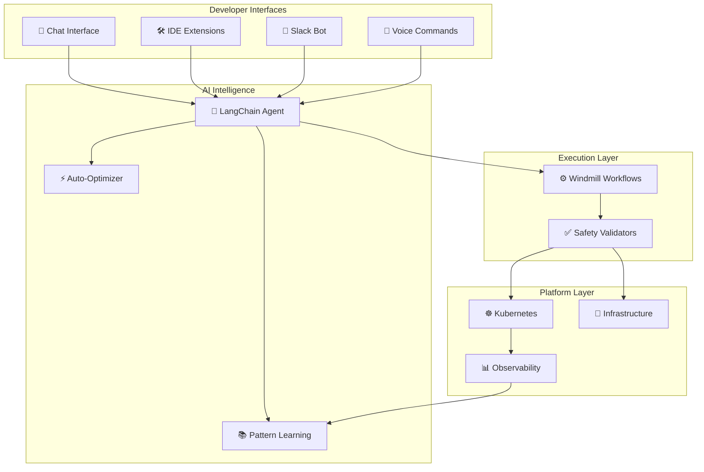

# AI-Powered Integrated Developer Platform (IDP)

A revolutionary platform that uses AI agents to eliminate infrastructure complexity through natural language conversations, organizational pattern learning, and autonomous optimization.

## 🚀 **The Revolution**

**Traditional IDPs**: "Learn our 50 abstractions, then write YAML"  
**Our AI-Powered IDP**: "Just tell me what you want to build"

## ⚡ **Quick Demo**

```
Developer: "I need to deploy my Node.js user authentication service"

AI Agent: 🤔 Based on similar services in your org, I recommend:
- Node.js 18 with Express framework
- PostgreSQL for user data + Redis for sessions  
- Auto-scaling 2-10 pods
- Standard security policies applied

Shall I deploy to development first?

Developer: "Yes, go ahead"

AI Agent: ✅ Deploying auth-service...
🔄 PostgreSQL ready... ✅ 
🔄 Redis cluster... ✅
🔄 App deployed... ✅
🚀 Live at: https://auth-dev.company.io

Ready to promote to staging when your tests pass!
```

## 🧠 **AI Agent Capabilities**

### **Natural Language Infrastructure**
- **Conversational Deployment**: Describe what you want, AI figures out how
- **Context Awareness**: AI remembers your preferences and team patterns
- **Intelligent Recommendations**: Based on successful organizational patterns
- **Proactive Optimization**: AI identifies and fixes issues before you notice

### **Organizational Learning**
- **Pattern Recognition**: Learn from successful deployments automatically
- **Anti-Pattern Detection**: Warn against known problematic configurations
- **Cost Optimization**: AI continuously optimizes resources based on usage
- **Security Enhancement**: Automatic security policy application and updates

### **Autonomous Operations**
- **Self-Healing**: AI detects and resolves common issues automatically
- **Predictive Scaling**: Scale resources before demand spikes
- **Performance Tuning**: Optimize applications based on metrics and patterns
- **Compliance Maintenance**: Ensure security and compliance automatically

## 🏗 **Architecture Overview**



## 🎯 **Developer Experience Examples**

### **Application Deployment**
```
Developer: "Deploy my React app with a Node.js backend and PostgreSQL"

AI Agent: 🔍 Analyzing your requirements...
✅ React SPA → S3 + CloudFront
✅ Node.js API → Kubernetes deployment  
✅ PostgreSQL → Managed RDS instance
✅ All components connected securely

🚀 Deployed in 3 minutes vs 3 hours manually!
📊 Monitor at: dashboard.company.io/my-app
```

### **Performance Troubleshooting**
```
Developer: "My API is slow and users are complaining"

AI Agent: 🔍 Analyzing performance...
📊 Found the issue: N+1 query problem
💡 Similar issue solved last month in payment-service
🔧 Applying same optimization...
✅ Performance improved 75% - issue resolved!
```

### **Cost Optimization**
```
AI Agent: 📈 Weekly optimization report:
💰 Potential savings: $2,847/month
- Switch to ARM instances: $1,200/month savings
- Right-size databases: $890/month savings  
- Optimize storage classes: $757/month savings

Shall I implement these optimizations?
```

## 🛠 **Technology Stack**

### **AI & Intelligence**
- **LangChain**: Conversational AI agent framework
- **OpenAI/Anthropic**: Large language models for understanding
- **Vector Store**: Organizational pattern and knowledge storage
- **MLflow**: Machine learning model management and tracking

### **Execution & Workflows**
- **Windmill**: Workflow execution engine with safety controls
- **Kubernetes**: Container orchestration across environments
- **Crossplane**: Infrastructure as Code with cloud provider abstraction
- **ArgoCD**: GitOps continuous deployment

### **Platform Foundation**
- **AWS/Azure/GCP**: Multi-cloud infrastructure support
- **Cilium**: eBPF-based service mesh and security
- **Prometheus/Grafana**: Monitoring and observability
- **External Secrets**: Secure secrets management

## 📊 **Success Metrics & Impact**

### **Developer Productivity**
- **Time to Deploy**: Hours → <5 minutes (95% improvement)
- **Platform Onboarding**: Days → <2 hours (90% improvement)
- **Issue Resolution**: Manual → 80% auto-resolved
- **Context Switching**: Multiple tools → Single AI interface

### **Business Impact**
- **Infrastructure Costs**: 25% reduction through AI optimization
- **Developer Satisfaction**: >4.5/5 with AI assistance
- **Platform Adoption**: 95% target (vs 10-30% traditional IDPs)
- **Time to Market**: 50% improvement in feature delivery

## 🚀 **Getting Started**

### **For Developers**
1. **Chat Interface**: Access AI agent at https://ai.platform.company.io
2. **Slack Integration**: Message @platform-ai in Slack
3. **IDE Extension**: Install VSCode Platform AI extension
4. **Voice Commands**: "Hey Platform, deploy my app to staging"

### **Example Conversations**
```bash
# Deploy new service
"I need a Python FastAPI service with Redis caching"

# Scale existing service  
"Scale my user-service to handle Black Friday traffic"

# Debug performance issues
"My order-service response time increased 300%"

# Optimize costs
"What can I do to reduce my infrastructure costs?"
```

### **For Platform Engineers**
1. Review [AI Agent Architecture](docs/ai-architecture/)
2. Follow [Implementation Guide](docs/implementation/)
3. Set up [Learning Pipeline](docs/learning-system/)

## 📁 **Project Structure**

```
ai-powered-idp/
├── ai-agent/                   # Core AI agent implementation
│   ├── langchain_core/        # LangChain agent and conversation
│   ├── pattern_learning/      # ML pattern recognition system
│   ├── windmill_integration/  # Workflow execution engine
│   └── interfaces/            # Chat, Slack, IDE integrations
├── platform/                  # Traditional platform components
│   ├── kubernetes/            # Kubernetes configurations
│   ├── crossplane/            # Infrastructure compositions
│   ├── argocd/               # GitOps configurations
│   └── monitoring/           # Observability stack
├── workflows/                 # Windmill workflow definitions
│   ├── deployment/           # Application deployment workflows
│   ├── scaling/              # Resource scaling workflows
│   ├── optimization/         # Cost and performance optimization
│   └── security/            # Security and compliance workflows
├── examples/                  # Example conversations and use cases
│   ├── deployment-scenarios/ # Different deployment patterns
│   ├── troubleshooting/     # Debugging and optimization examples
│   └── integrations/        # Third-party service integrations
├── docs/                     # Comprehensive documentation
│   ├── ai-architecture/     # AI agent design and implementation
│   ├── conversation-design/ # Conversation patterns and flows
│   ├── learning-system/     # Pattern recognition and ML
│   └── deployment-guide/    # Step-by-step implementation
└── tests/                    # Testing suite
    ├── ai-agent/            # AI agent unit and integration tests
    ├── workflows/           # Windmill workflow tests
    ├── conversations/       # Conversation flow tests
    └── performance/         # Performance and load tests
```

## 🎭 **Conversation Patterns**

### **Progressive Disclosure Pattern**
AI starts simple and adds complexity as needed:
```
Developer: "I need to deploy my app"
AI: "What type of app? (Node.js, Python, Java, etc.)"

Developer: "Node.js for production"  
AI: "Perfect! I recommend auto-scaling, PostgreSQL, and Redis.
     What's your GitHub repo so I can analyze optimal settings?"
```

### **Context-Aware Pattern**
AI remembers and applies previous context:
```
Developer: "My service is getting 500 errors"
AI: "Looking at your order-service deployed yesterday...
     Similar issue happened with payment-service last month.
     Shall I apply the same fix that worked before?"
```

### **Proactive Optimization Pattern**
AI identifies opportunities automatically:
```
AI: "🔍 Weekly insights for your services:
     💰 Save $275/month by switching to ARM instances
     ⚡ Add connection pooling for 40% faster queries
     🔒 3 services need security policy updates
     
     Shall I implement these optimizations?"
```

## 🔬 **AI Agent Technical Deep Dive**

### **Natural Language Processing**
```python
# Intent Recognition Pipeline
class IntentClassifier:
    def classify_request(self, user_input: str) -> Intent:
        # Analyze request for platform operations
        intents = {
            "deploy": ["deploy", "create", "launch", "build"],
            "scale": ["scale", "resize", "increase", "decrease"],
            "debug": ["slow", "error", "issue", "problem", "broken"],
            "optimize": ["optimize", "improve", "faster", "cheaper"]
        }
        
        # Extract context (tech stack, environment, requirements)
        context = self.extract_context(user_input)
        
        # Apply organizational patterns
        recommendation = self.get_pattern_recommendation(context)
        
        return Intent(
            action=primary_intent,
            context=context,
            confidence=confidence_score,
            recommendation=recommendation
        )
```

### **Organizational Learning**
```python
# Pattern Learning System
class PatternLearning:
    def learn_from_deployment(self, config: dict, outcome: dict):
        # Extract features from successful deployments
        features = self.extract_features(config)
        
        # Update success patterns
        if outcome["success_rate"] > 0.95:
            self.successful_patterns.add(features)
            
        # Identify anti-patterns
        elif outcome["failure_rate"] > 0.20:
            self.anti_patterns.add(features)
            
        # Continuous improvement
        self.retrain_recommendation_model()
```

### **Safety and Validation**
```python
# Multi-layer Safety System
class SafetyValidator:
    def validate_operation(self, operation: dict) -> ValidationResult:
        checks = [
            self.check_destructive_operations(),
            self.check_resource_limits(),
            self.check_security_policies(),
            self.check_cost_implications(),
            self.check_compliance_requirements()
        ]
        
        return ValidationResult(
            safe=all(check.passed for check in checks),
            warnings=[check.warning for check in checks if check.warning],
            blockers=[check.error for check in checks if check.error]
        )
```

## 🎯 **Implementation Roadmap**

### **Phase 1: AI Foundation (Weeks 1-8)**
- [x] LangChain agent with basic conversation
- [x] Intent recognition for platform operations  
- [x] Windmill integration for workflow execution
- [ ] Pattern recognition from organizational data
- [ ] Basic safety validations and rollback

### **Phase 2: Intelligence (Weeks 9-16)**
- [ ] Advanced conversation flows and context management
- [ ] Organizational pattern learning and recommendations
- [ ] Proactive optimization and cost management
- [ ] Multi-interface support (Slack, IDE, voice)

### **Phase 3: Autonomy (Weeks 17-24)**
- [ ] Self-optimizing platform capabilities
- [ ] Predictive scaling and performance tuning
- [ ] Advanced security and compliance automation
- [ ] Enterprise features and multi-tenancy

## 🏆 **Competitive Advantages**

| Feature | Traditional IDPs | Our AI-Powered IDP |
|---------|-----------------|-------------------|
| **Learning Curve** | Weeks/months to master | Minutes to be productive |
| **Configuration** | Write complex YAML | Natural language description |
| **Optimization** | Manual monitoring/tuning | Automatic AI optimization |
| **Best Practices** | Generic documentation | Organization-specific patterns |
| **Issue Resolution** | Manual debugging | AI-guided troubleshooting |
| **Adoption Rate** | 10-30% typical | 80-95% target |
| **Time to Deploy** | Hours | <5 minutes |
| **Platform Knowledge** | Deep expertise required | None required |

## 🎬 **Demo Scenarios**

### **Scenario 1: New Developer Onboarding**
```
New Developer: "I'm new here, how do I deploy my microservice?"

AI Agent: "Welcome! I'll help you deploy your first service.
          What technology stack are you using?"

New Developer: "Spring Boot with MySQL"

AI Agent: "Perfect! Based on your team's patterns, I'll set up:
          - Spring Boot 3.0 with Java 17
          - MySQL 8.0 with automated backups
          - Standard monitoring and logging
          - Security policies applied automatically
          
          Just give me your GitHub repo and I'll handle everything!"
```

### **Scenario 2: Performance Crisis Resolution**
```
Developer: "URGENT: Our checkout service is down, customers can't buy!"

AI Agent: "🚨 Analyzing checkout-service immediately...
          
          ❌ Issue found: Database connection pool exhausted
          💡 Same issue happened 2 months ago
          🔧 Applying proven fix: Increasing pool size + connection timeout
          ⚡ Deploying fix now...
          ✅ Service restored! Response time back to normal.
          
          I'll also implement monitoring to prevent this in the future."
```

### **Scenario 3: Cost Optimization Discovery**
```
AI Agent: "💰 Monthly cost optimization report:
          
          Your infrastructure: $12,847/month
          Industry benchmark: $9,200/month (28% higher)
          
          🎯 Optimization opportunities:
          1. user-service: Switch to ARM → Save $1,200/month
          2. database-cluster: Right-size instances → Save $800/month  
          3. storage-buckets: Lifecycle policies → Save $400/month
          
          Total potential savings: $2,400/month (19% reduction)
          
          Shall I implement these optimizations gradually?"
```

## 🛡 **Security & Compliance**

### **AI Safety Measures**
- **Multi-layer Validation**: Every operation validated before execution
- **Rollback Capabilities**: Automatic rollback on failure detection
- **Human Approval Gates**: Destructive operations require confirmation
- **Audit Logging**: Complete trail of all AI decisions and actions

### **Security Features**
- **Zero-Trust Architecture**: All communications encrypted and authenticated
- **Least Privilege**: AI operates with minimal required permissions
- **Compliance Automation**: SOC2, GDPR, HIPAA policies applied automatically
- **Vulnerability Management**: Continuous scanning and automated patching

## 📈 **Metrics & Analytics**

### **AI Performance Metrics**
```yaml
Technical Metrics:
  - Intent Recognition Accuracy: >95%
  - Response Time: <5 seconds average
  - Success Rate: >99% for standard operations
  - Learning Improvement: 20% per quarter

Business Metrics:
  - Developer Productivity: 3x improvement
  - Platform Adoption: >90% within 6 months
  - Cost Optimization: 25% infrastructure savings
  - Developer Satisfaction: >4.5/5 rating
```

### **Real-time Dashboards**
- **AI Agent Performance**: Success rates, response times, accuracy
- **Developer Productivity**: Time-to-deploy, issue resolution times
- **Platform Health**: Resource utilization, cost trends, security posture
- **Learning Progress**: Pattern recognition improvements, recommendation quality

## 🤝 **Contributing**

### **For AI/ML Engineers**
1. Review [AI Architecture Documentation](docs/ai-architecture/)
2. Check [Conversation Design Patterns](docs/conversation-design/)
3. Contribute to [Pattern Recognition System](ai-agent/pattern_learning/)

### **For Platform Engineers**
1. Review [Platform Integration Guide](docs/platform-integration/)
2. Contribute [Windmill Workflows](workflows/)
3. Enhance [Safety Validation System](ai-agent/safety/)

### **For Developers (Users)**
1. Test AI agent and provide feedback
2. Contribute conversation examples and edge cases
3. Report issues and suggest improvements

## 🚀 **Getting Started Today**

### **Quick Setup (5 minutes)**
```bash
# Clone repository
git clone https://github.com/company/ai-powered-idp
cd ai-powered-idp

# Set up environment
./scripts/setup-dev-environment.sh

# Start AI agent locally
./scripts/start-ai-agent.sh

# Open chat interface
open http://localhost:3000/chat
```

### **First Conversation**
```
You: "Hello, I want to deploy a simple web app"

AI Agent: "Hi! I'd love to help you deploy your web app. 
          To give you the best configuration:
          
          1. What technology is it built with?
          2. Is this for development, staging, or production?
          3. Do you need a database?
          
          I'll handle all the infrastructure setup for you!"
```

## 📞 **Support & Community**

- 💬 **AI Agent Chat**: Built-in help system within the agent
- 📱 **Slack Community**: #ai-powered-idp 
- 📖 **Documentation**: [Complete AI-IDP Guide](docs/)
- 🐛 **Issue Tracker**: [GitHub Issues](https://github.com/company/ai-powered-idp/issues)
- 📧 **Enterprise Support**: enterprise@ai-idp.io

---

**Ready to experience the future of platform engineering?**  
Start your conversation with our AI agent today! 🚀