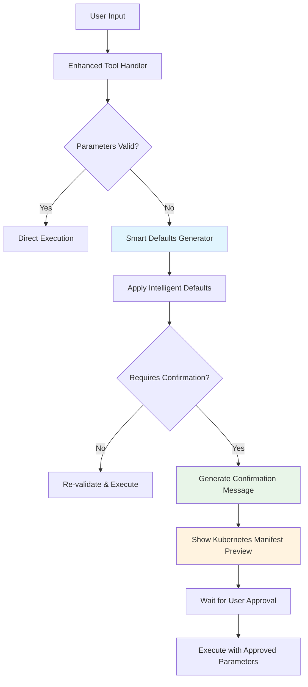

# Assume-and-Confirm Framework Documentation

## Overview

The Assume-and-Confirm Framework is a cost-effective parameter completion system that eliminates the need for expensive LLM calls while providing full transparency to users. Instead of using AI to guess missing parameters, the system applies intelligent defaults and shows users exactly what will be deployed before execution.

**✅ Single Implementation Focus**: As of the latest update, we have simplified to use only the HTTP MCP implementation with enhanced tool handlers, removing all legacy fallback mechanisms for a cleaner, more maintainable codebase.

## Architecture



## Key Components

### 1. Enhanced Tool Handlers

Each tool in the infrastructure agent can be enhanced with the assume-and-confirm framework by providing:

```typescript
interface EnhancedToolHandler {
  handler: Function;                    // Original tool implementation
  schema: ZodSchema;                    // Parameter validation schema
  defaultsGenerator?: DefaultsGenerator; // Smart defaults function
  requiresConfirmation: boolean;        // Whether to require user approval
  description: string;                  // Human-readable description
  confirmationMessageGenerator?: ConfirmationMessageGenerator; // Custom preview message
}
```

### 2. Smart Defaults Generators

Functions that intelligently fill missing parameters based on context and heuristics:

```typescript
type DefaultsGenerator = (
  providedArgs: Record<string, any>,
  context?: ConversationContext
) => Promise<Record<string, any>>;
```

**Example: Container Image Detection**
```typescript
// Input: { image: "postgres:13" }
// Smart Detection Logic:
if (image.includes('postgres')) {
  defaults.port = 5432;              // PostgreSQL default port
  defaults.resources = {             // Database-optimized resources
    cpu: '500m',
    memory: '512Mi'
  };
}
```

### 3. Confirmation Message Generators

Functions that create user-friendly previews of what will be deployed:

```typescript
type ConfirmationMessageGenerator = (
  toolName: string,
  assumptions: Record<string, any>
) => string;
```

**Example Output:**
```
Ready to deploy nginx-app with the following configuration:

📋 **Deployment Settings:**
• Name: nginx-app
• Image: nginx:latest
• Namespace: default
• Replicas: 1
• Port: 80
• CPU: 100m
• Memory: 128Mi

📄 **Kubernetes Manifest Preview:**
```yaml
apiVersion: apps/v1
kind: Deployment
metadata:
  name: nginx-app
  namespace: default
spec:
  replicas: 1
  selector:
    matchLabels:
      app: nginx-app
  template:
    metadata:
      labels:
        app: nginx-app
    spec:
      containers:
      - name: nginx-app
        image: nginx:latest
        ports:
        - containerPort: 80
        resources:
          requests:
            cpu: 100m
            memory: 128Mi
---
apiVersion: v1
kind: Service
metadata:
  name: nginx-app
  namespace: default
spec:
  selector:
    app: nginx-app
  ports:
  - port: 80
    targetPort: 80
  type: ClusterIP
```

This will create a Deployment and Service in your Kubernetes cluster.
```

## Implementation Details

### HTTPMCPServer Integration

The framework is integrated into the HTTPMCPServer's `processEnhancedToolCall` method:

```typescript
/**
 * Process enhanced tool call with assume-and-confirm functionality
 *
 * Workflow:
 * 1. Validate provided parameters using Zod schemas
 * 2. Generate smart defaults for missing parameters
 * 3. Show users confirmation with Kubernetes manifest previews
 * 4. Execute tool only after user confirmation
 */
private async processEnhancedToolCall(
  toolName: string,
  args: Record<string, any>,
  context: ConversationContext
): Promise<any>
```

**Step-by-Step Process:**

1. **Tool Handler Lookup**: Retrieve enhanced handler or fallback to legacy
2. **Parameter Validation**: Use Zod schema to validate user input
3. **Smart Defaults Application**: Generate intelligent defaults for missing parameters
4. **Re-validation**: Ensure merged parameters pass validation
5. **Confirmation Check**: Determine if user approval is required
6. **Message Generation**: Create confirmation message with manifest preview
7. **Execution**: Run tool with validated parameters after approval

### Smart Detection Logic

#### Port Detection
The system analyzes container image names to determine appropriate ports:

| Image Pattern | Default Port | Use Case |
|--------------|--------------|----------|
| `nginx`, `apache` | 80 | Web servers |
| `postgres`, `postgresql` | 5432 | PostgreSQL database |
| `redis` | 6379 | Redis cache |
| `mongo`, `mongodb` | 27017 | MongoDB database |
| `mysql` | 3306 | MySQL database |
| *unknown* | 80 | Generic web application |

#### Resource Allocation
CPU and memory defaults based on workload characteristics:

| Workload Type | CPU | Memory | Reasoning |
|--------------|-----|--------|-----------|
| Database (`postgres`, `mysql`, `mongo`) | 500m | 512Mi | Data processing requires more resources |
| Web Server (`nginx`, `apache`) | 100m | 128Mi | Typically I/O bound, lighter requirements |
| Generic Application | 100m | 128Mi | Conservative baseline for microservices |

#### Namespace and Replicas
- **Namespace**: Defaults to `default` (most common for development)
- **Replicas**: Defaults to `1` (simplicity and resource efficiency)

### Configuration Patterns

#### High-Risk Operations (Require Confirmation)
```typescript
deployApplication: {
  requiresConfirmation: true,          // Always require approval
  confirmationMessageGenerator: generateDeploymentConfirmationMessage
}
```

#### Medium-Risk Operations (Confirmation Optional)
```typescript
scaleResource: {
  requiresConfirmation: true,          // Scaling can impact production
  // Uses default confirmation message (no custom generator)
}
```

#### Low-Risk Operations (No Confirmation)
```typescript
getResourceStatus: {
  requiresConfirmation: false,         // Read-only operation
  // No defaultsGenerator needed
}
```

## Benefits

### 🎯 Cost-Effective
- **No LLM Calls**: Eliminates expensive API calls for parameter completion
- **Deterministic**: Consistent defaults based on clear rules, not AI inference
- **Fast**: Instant parameter completion without network round-trips

### 🔍 Transparent
- **Full Visibility**: Users see complete Kubernetes manifests before deployment
- **No Surprises**: Clear preview of resources that will be created
- **Trust Building**: Users understand exactly what the system is doing

### ⚡ Smart
- **Context-Aware**: Defaults adapt based on container images and workload types
- **Developer-Friendly**: Sensible defaults that match common patterns
- **Extensible**: Easy to add new detection patterns and defaults

### 🛡️ Safe
- **Validation**: Comprehensive parameter validation with clear error messages
- **Confirmation**: User approval required for high-risk operations
- **Single Implementation**: Focused, maintainable codebase without legacy complexity

### 🏗 Production Focused
- **Single HTTP MCP Implementation**: One robust, well-tested approach
- **No Legacy Fallbacks**: Clean codebase focused on production requirements
- **Enhanced Tool Handlers Only**: Unified approach using assume-and-confirm framework

## Testing

The framework includes comprehensive test coverage:

```bash
# Run MCP assume-and-confirm tests
node scripts/test-mcp-assume-confirm.js

# Test direct assume-and-confirm logic
node scripts/test-direct-assume-confirm.js
```

**Test Coverage:**
- ✅ Smart defaults generation
- ✅ Kubernetes manifest preview
- ✅ Parameter validation pipeline
- ✅ MCP integration
- ✅ Error handling and fallbacks

## Future Enhancements

### Additional Smart Detection
- **Security Context**: Default security settings based on image type
- **Health Checks**: Automatic liveness/readiness probes for known applications
- **Volume Mounts**: Default persistent storage for databases
- **Environment Variables**: Common environment variables for popular images

### Extended Confirmation Features
- **Cost Estimation**: Show resource costs before deployment
- **Impact Analysis**: Highlight potential effects on existing resources
- **Diff Preview**: Show changes when updating existing deployments
- **Rollback Plan**: Preview rollback strategy before risky operations

### Performance Optimizations
- **Schema Caching**: Cache compiled Zod schemas for better performance
- **Default Memoization**: Cache computed defaults for repeated patterns
- **Manifest Templates**: Pre-compiled YAML templates for common scenarios

## Related Documentation

- **[HTTPMCPServer Implementation](../packages/agents/infrastructure/src/mcp/HTTPMCPServer.ts)**: Core integration logic
- **[Infrastructure Schemas](../packages/agents/infrastructure/src/schemas/infrastructure.ts)**: Validation and defaults
- **[Enhanced Tool Handlers](../packages/agents/infrastructure/src/agent/InfrastructureAgent.ts)**: Tool configuration
- **[Test Suite](../scripts/test-mcp-assume-confirm.js)**: Comprehensive testing framework