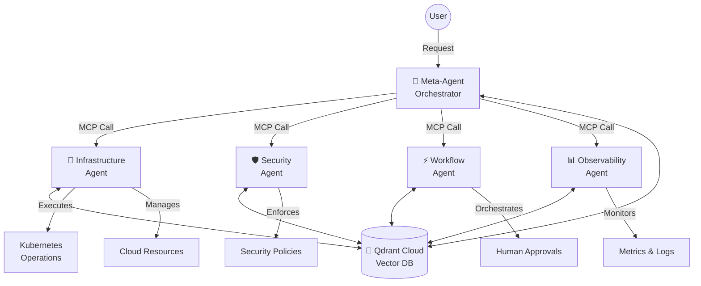
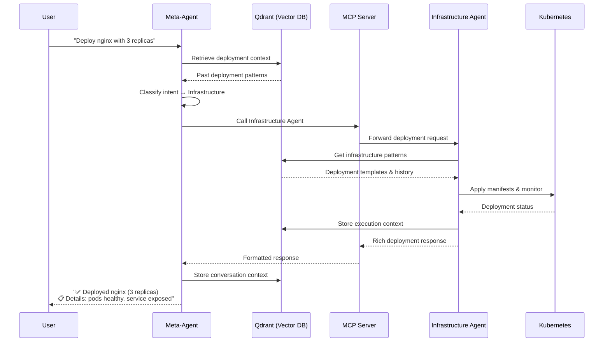
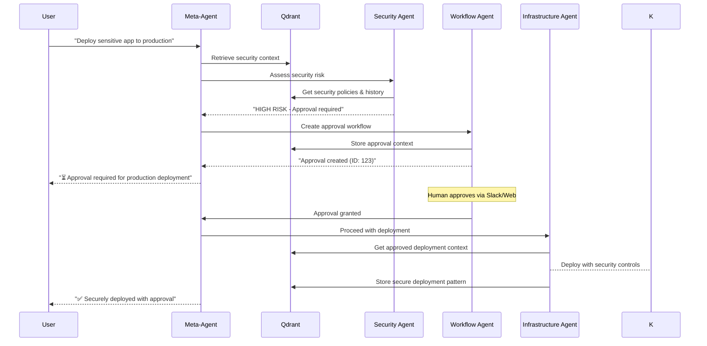

# Multi-Agent IDP Architecture with Meta-Agent, Focused Agents, and Qdrant

## 1. Conversation Summary & Evolution

We evolved from a **single modular agent** approach to a sophisticated **multi-agent orchestration system**. The transformation addresses scalability, specialization, and shared intelligence requirements for an enterprise-grade IDP.

### Key Architectural Decisions:
- **Meta-Agent**: Centralized orchestrator that routes tasks to specialized agents
- **Focused Agents**: Domain-specific agents (Infrastructure, Security, Workflow, Observability)  
- **Shared Intelligence**: Qdrant vector database for cross-agent context and learning
- **MCP Protocol**: Model Context Protocol for standardized agent-to-agent communication
- **Qdrant Cloud**: Free starter tier for vector database hosting

## 2. Architecture Overview

### High-Level Architecture


### Sequence Diagram: Deploy Request Flow


### Sequence Diagram: Multi-Agent Security Workflow


## 3. Agent Specifications

### 🧠 Meta-Agent (Central Orchestrator)
**Technology**: TypeScript + Fastify + Qdrant Client + MCP Client
**LLM**: Anthropic Claude or GPT-4 (larger model for complex reasoning)

**Role**: Central orchestrator that receives user input, performs context lookup, and decides which focused agent(s) to invoke.

**Core Capabilities**:
- **Intent Classification**: Advanced LLM-based classification of user requests
- **Context Retrieval**: Query Qdrant for relevant historical context and patterns
- **Agent Routing**: Intelligent selection of appropriate focused agent(s)
- **Response Synthesis**: Aggregate and format responses from multiple agents
- **Learning Orchestration**: Store conversation patterns and decision trees in Qdrant
- **Multi-Agent Workflows**: Coordinate complex workflows across multiple agents

**Flow**: User → Meta-Agent → Focused Agent → MCP Server → Action → Response → User

**Key Components**:
```typescript
interface MetaAgent {
  classifyIntent(userInput: string): Promise<AgentIntent>;
  retrieveContext(query: string): Promise<ContextVector[]>;
  routeToAgent(intent: AgentIntent, context: ConversationContext): Promise<AgentResponse>;
  coordinateWorkflow(workflow: MultiAgentWorkflow): Promise<WorkflowResult>;
  synthesizeResponse(responses: AgentResponse[]): Promise<UserResponse>;
  storeInteraction(interaction: AgentInteraction): Promise<void>;
}
```

### 🔧 Infrastructure Agent (Kubernetes + Cloud Management)
**Technology**: TypeScript + MCP SDK + Kubernetes Client + Crossplane + Qdrant Client
**SLM**: Lightweight LLM (Llama-3-8B-instruct) specialized for infrastructure operations

**Purpose**: Manage workloads, deployments, pods, services on EKS and provision AWS resources via Crossplane.

**Core Capabilities**:
- **Kubernetes Operations**: Deploy, scale, status, logs, rollback operations
- **Cloud Provisioning**: AWS resources (RDS, DynamoDB, S3, Lambda) via Crossplane
- **Container Orchestration**: Pod management, service discovery, ingress configuration
- **Infrastructure Pattern Recognition**: Learn optimal deployment configurations from Qdrant
- **Resource Optimization**: Right-sizing recommendations based on historical usage

**MCP Server Integration**: Wraps kubectl, Helm, K8s APIs, Crossplane, and AWS SDK

**Example Workflows**:
1. **Deploy Microservice**: 
   - User: "Deploy web app X with 3 replicas"
   - Agent: Generates deployment.yaml, applies to EKS, configures service mesh
   - Response: Service URL, health status, monitoring endpoints

2. **Provision Database**: 
   - User: "Create PostgreSQL for my app"
   - Agent: Uses Crossplane to provision RDS, creates K8s secret with credentials
   - Response: Connection endpoint, credentials location

3. **Scale Application**:
   - User: "Scale payment service based on load"
   - Agent: Analyzes metrics, adjusts HPA settings, monitors scaling
   - Response: New replica count, expected capacity

**MCP Tools Exposed**:
```typescript
interface InfrastructureTools {
  // Kubernetes Operations
  deployApplication(spec: ApplicationSpec): Promise<DeploymentResult>;
  scaleResource(resource: K8sResource, replicas: number): Promise<ScalingResult>;
  getResourceStatus(resource: K8sResource): Promise<StatusResult>;
  getResourceLogs(resource: K8sResource, options: LogOptions): Promise<LogResult>;
  rollbackDeployment(deployment: string, revision?: number): Promise<RollbackResult>;
  
  // Cloud Operations (via Crossplane)
  provisionDatabase(config: DatabaseConfig): Promise<ProvisionResult>;
  createStorage(config: StorageConfig): Promise<StorageResult>;
  deployFunction(config: FunctionConfig): Promise<FunctionResult>;
  manageSecrets(secrets: SecretConfig[]): Promise<SecretResult>;
}
```

### 🛡️ Security Agent (Compliance & Vulnerability Management)
**Technology**: TypeScript + MCP SDK + Policy Engine + Security Scanners + Qdrant Client
**SLM**: Lightweight LLM with focus on security scanning and policy enforcement

**Purpose**: Ensure compliance, detect vulnerabilities, and enforce security policies across the platform.

**Core Capabilities**:
- **Policy Enforcement**: RBAC validation, OPA/Gatekeeper policy compliance
- **Vulnerability Scanning**: Container image CVE detection, dependency analysis
- **Risk Assessment**: Dynamic ML-based risk evaluation for operations
- **Compliance Monitoring**: Continuous compliance reporting and alerting
- **Adaptive Policies**: Learn and evolve security policies from historical patterns
- **Threat Detection**: Real-time security monitoring and incident response

**MCP Server Integration**: Integrates with Trivy, OPA/Gatekeeper, Snyk, Falco, and security scanners

**Example Workflows**:
1. **Container Security Scan**:
   - User: Attempts to deploy new container image
   - Agent: Scans image with Trivy, checks against policy
   - Response: Vulnerability report, policy compliance status, recommendations

2. **Policy Validation**:
   - User: "Deploy to production"  
   - Agent: Validates against OPA policies, checks RBAC permissions
   - Response: Policy compliance, required approvals, security controls

3. **Incident Response**:
   - Alert: Suspicious activity detected
   - Agent: Analyzes threat, correlates with historical patterns
   - Response: Threat assessment, recommended actions, automated remediation

**MCP Tools Exposed**:
```typescript
interface SecurityTools {
  // Vulnerability Management
  scanContainerImage(image: string): Promise<VulnerabilityReport>;
  analyzeDependencies(manifest: string): Promise<DependencyAnalysis>;
  
  // Policy Enforcement  
  validatePolicy(resource: K8sResource): Promise<PolicyValidation>;
  assessRisk(operation: Operation): Promise<RiskAssessment>;
  enforceCompliance(deployment: Deployment): Promise<ComplianceResult>;
  
  // Threat Detection
  detectThreats(context: SecurityContext): Promise<ThreatDetection>;
  analyzeAnomalies(metrics: SecurityMetrics): Promise<AnomalyAnalysis>;
  respondToIncident(incident: SecurityIncident): Promise<IncidentResponse>;
}
```

### ⚡ Workflow Agent (Approval & Process Management)
**Technology**: TypeScript + MCP SDK + Workflow Engine + Notification Services + Qdrant Client
**SLM**: Lightweight LLM focused on process orchestration and approval routing

**Purpose**: Manage human-in-the-loop approval workflows, complex multi-step processes, and integration orchestration.

**Core Capabilities**:
- **Approval Orchestration**: Risk-based approval routing with intelligent escalation
- **Multi-Step Workflows**: Complex process management with dependency tracking
- **Integration Hub**: Slack, email, webhooks, and notification management
- **Pattern Learning**: Optimize approval flows based on historical decisions stored in Qdrant
- **Process Automation**: Automated workflow triggers and conditional branching
- **Human Handoff**: Seamless transition between automated and manual processes

**MCP Server Integration**: Integrates with Slack API, GitHub Actions, ArgoCD, Jenkins, email services

**Example Workflows**:
1. **Production Deployment Approval**:
   - User: Requests production deployment
   - Agent: Assesses risk, creates approval with context, notifies via Slack
   - Response: Approval created, stakeholders notified, tracking URL provided

2. **CI/CD Pipeline Orchestration**:  
   - Trigger: PR merged to main branch
   - Agent: Triggers build pipeline, manages deployment stages, handles approvals
   - Response: Pipeline status, stage completions, deployment confirmation

3. **Incident Response Workflow**:
   - Alert: Critical system failure detected
   - Agent: Creates incident, assigns responders, coordinates communication
   - Response: Incident created, war room established, stakeholders notified

**MCP Tools Exposed**:
```typescript
interface WorkflowTools {
  // Approval Management
  createApproval(request: ApprovalRequest): Promise<ApprovalResult>;
  processApprovalDecision(approvalId: string, decision: ApprovalDecision): Promise<DecisionResult>;
  
  // Workflow Orchestration
  executeWorkflow(workflow: WorkflowDefinition): Promise<WorkflowResult>;
  trackWorkflowProgress(workflowId: string): Promise<ProgressStatus>;
  pauseWorkflow(workflowId: string, reason: string): Promise<PauseResult>;
  
  // Notifications & Integration
  sendNotification(notification: NotificationRequest): Promise<NotificationResult>;
  triggerPipeline(pipeline: PipelineConfig): Promise<PipelineResult>;
  createIncident(incident: IncidentRequest): Promise<IncidentResult>;
}
```

### 📊 Observability Agent (Monitoring & Analytics)
**Technology**: TypeScript + MCP SDK + Monitoring APIs + Analytics Engine + Qdrant Client  
**SLM**: Lightweight LLM tuned for monitoring queries and anomaly analysis

**Purpose**: Collect and analyze metrics, logs, traces; provide intelligent monitoring and performance optimization.

**Core Capabilities**:
- **Metrics Collection**: Real-time metrics from Prometheus, custom exporters, cloud services
- **Log Analysis**: Intelligent log aggregation, pattern detection, error correlation
- **Distributed Tracing**: Request flow analysis across microservices via OpenTelemetry
- **Anomaly Detection**: ML-based detection of performance and behavioral anomalies
- **Performance Optimization**: Historical analysis and right-sizing recommendations
- **Predictive Alerting**: Proactive alerts based on pattern recognition from Qdrant

**MCP Server Integration**: Connects to Prometheus, Loki, Tempo, OpenTelemetry APIs, cloud monitoring services

**Example Workflows**:
1. **Performance Investigation**:
   - User: "Why is my API slow?"
   - Agent: Analyzes traces, correlates with metrics, identifies bottlenecks
   - Response: Root cause analysis, performance recommendations, optimization suggestions

2. **Proactive Alert Generation**:
   - Pattern: High CPU usually precedes memory issues
   - Agent: Detects CPU spike, predicts memory pressure, creates preemptive alert
   - Response: Early warning with recommended actions

3. **Service Health Assessment**:
   - User: "Show me the health of payment service"
   - Agent: Aggregates metrics, logs, traces; analyzes trends
   - Response: Health dashboard, SLI/SLO status, performance insights

**MCP Tools Exposed**:
```typescript
interface ObservabilityTools {
  // Metrics & Monitoring  
  collectMetrics(source: MetricSource, timeRange: TimeRange): Promise<MetricCollection>;
  queryMetrics(query: MetricQuery): Promise<MetricResult>;
  createAlert(conditions: AlertConditions): Promise<AlertResult>;
  
  // Log Analysis
  analyzeLogs(query: LogQuery): Promise<LogAnalysis>;
  searchLogs(pattern: string, filters: LogFilters): Promise<LogSearchResult>;
  detectLogAnomalies(service: string, timeRange: TimeRange): Promise<AnomalyReport>;
  
  // Distributed Tracing
  traceRequest(traceId: string): Promise<TraceAnalysis>;
  analyzeLatency(service: string, operation: string): Promise<LatencyAnalysis>;
  findBottlenecks(serviceMap: ServiceMap): Promise<BottleneckAnalysis>;
  
  // Intelligence & Optimization
  predictAnomalies(metrics: HistoricalMetrics): Promise<AnomalyPrediction>;
  recommendOptimization(service: string): Promise<OptimizationRecommendations>;
  generateHealthReport(services: string[]): Promise<HealthReport>;
}
```

### 🚀 CI/CD Agent (Pipeline & Deployment Management)
**Technology**: TypeScript + MCP SDK + CI/CD APIs + Git Integration + Qdrant Client
**SLM**: Pipeline-focused lightweight LLM for build and deployment orchestration

**Purpose**: Manage CI/CD pipelines, builds, deployments, and release orchestration.

**Core Capabilities**:
- **Pipeline Management**: Create, trigger, monitor CI/CD pipelines across platforms
- **Build Orchestration**: Manage build processes, artifact storage, quality gates
- **Deployment Automation**: Automated deployment strategies (blue-green, canary, rolling)
- **Release Management**: Version control, release notes, rollback coordination
- **Quality Assurance**: Test execution, code coverage analysis, security scanning integration
- **Pattern Learning**: Optimize deployment strategies based on historical success patterns

**MCP Server Integration**: Interfaces with GitHub Actions, ArgoCD, Jenkins, GitLab CI, Azure DevOps

**Example Workflows**:
1. **Automated CI/CD Pipeline**:
   - Trigger: Code pushed to main branch
   - Agent: Triggers build, runs tests, deploys to staging, awaits approval for production
   - Response: Pipeline status, test results, deployment confirmation

2. **Release Management**:
   - User: "Create release v2.1.0 and deploy to production"
   - Agent: Creates release branch, generates release notes, triggers production deployment
   - Response: Release created, deployment initiated, monitoring dashboard

3. **Pipeline Troubleshooting**:
   - User: "Why did my deployment fail?"
   - Agent: Analyzes pipeline logs, identifies failure points, suggests fixes
   - Response: Failure analysis, recommended actions, retry options

**MCP Tools Exposed**:
```typescript
interface CICDTools {
  // Pipeline Management
  triggerPipeline(repository: string, branch: string, config?: PipelineConfig): Promise<PipelineResult>;
  monitorPipeline(pipelineId: string): Promise<PipelineStatus>;
  cancelPipeline(pipelineId: string, reason: string): Promise<CancelResult>;
  
  // Build Management
  createBuild(buildSpec: BuildSpecification): Promise<BuildResult>;
  uploadArtifact(artifact: Artifact, destination: string): Promise<UploadResult>;
  downloadArtifact(artifactId: string): Promise<DownloadResult>;
  
  // Deployment Management
  deployApplication(deployment: DeploymentSpec): Promise<DeploymentResult>;
  promoteRelease(release: string, fromEnv: string, toEnv: string): Promise<PromotionResult>;
  rollbackDeployment(deployment: string, targetRevision?: string): Promise<RollbackResult>;
  
  // Release Management
  createRelease(release: ReleaseSpec): Promise<ReleaseResult>;
  generateReleaseNotes(fromTag: string, toTag: string): Promise<ReleaseNotes>;
  tagRepository(repository: string, tag: string, message: string): Promise<TagResult>;
}
```

## 4. Shared Intelligence Layer (Qdrant)

### Vector Database Schema
```typescript
interface ContextVector {
  id: string;
  vector: number[]; // Embedding vector
  payload: {
    type: 'conversation' | 'decision' | 'execution' | 'pattern';
    agent: string;
    timestamp: string;
    content: string;
    metadata: Record<string, any>;
  };
}
```

### Context Storage Patterns
- **Conversations**: User interactions and agent responses
- **Decisions**: Approval decisions and reasoning  
- **Executions**: Infrastructure operations and outcomes
- **Patterns**: Learned behaviors and recommendations

### Context Retrieval Strategies
- **Semantic Search**: Find similar past interactions
- **Pattern Matching**: Identify recurring scenarios
- **Decision History**: Retrieve relevant approval precedents
- **Performance Analysis**: Historical performance patterns

## 5. Communication Protocol (MCP)

### MCP Message Format
```typescript
interface MCPRequest {
  method: string;
  params: Record<string, any>;
  id: string;
  context: ConversationContext;
}

interface MCPResponse {
  result?: any;
  error?: MCPError;
  id: string;
  metadata: ResponseMetadata;
}
```

### Agent Registration
Each focused agent registers its capabilities with the Meta-Agent:
```typescript
interface AgentCapabilities {
  agentId: string;
  name: string;
  description: string;
  tools: ToolDefinition[];
  specializations: string[];
}
```

## 6. Deployment Architecture

### Container Strategy
```yaml
# docker-compose.multi-agent.yml
services:
  meta-agent:
    image: ai-idp/meta-agent:latest
    ports: ["3000:3000"]
    environment:
      - QDRANT_URL=${QDRANT_URL}
      - ANTHROPIC_API_KEY=${ANTHROPIC_API_KEY}
  
  infrastructure-agent:
    image: ai-idp/infrastructure-agent:latest
    ports: ["3001:3001"]
    environment:
      - MCP_PORT=3001
      - QDRANT_URL=${QDRANT_URL}
  
  security-agent:
    image: ai-idp/security-agent:latest
    ports: ["3002:3002"]
    
  workflow-agent:
    image: ai-idp/workflow-agent:latest
    ports: ["3003:3003"]
    
  observability-agent:
    image: ai-idp/observability-agent:latest
    ports: ["3004:3004"]
```

### Kubernetes Deployment
- Each agent deployed as independent service
- Horizontal pod autoscaling based on load
- Service mesh for secure agent-to-agent communication
- Shared Qdrant Cloud instance for vector storage

## 7. Benefits & Advantages

### Scalability
- **Independent Scaling**: Each agent scales based on domain-specific load
- **Resource Optimization**: Specialized resource allocation per agent type
- **Load Distribution**: Work distributed across multiple specialized agents

### Reliability
- **Fault Isolation**: Failure of one agent doesn't affect others
- **Graceful Degradation**: Meta-Agent can route around failed agents
- **Redundancy**: Multiple instances of each agent type

### Intelligence
- **Shared Learning**: All agents contribute to and benefit from shared knowledge
- **Pattern Recognition**: Cross-domain pattern identification and optimization
- **Adaptive Behavior**: Agents improve based on historical interactions

### Maintainability
- **Separation of Concerns**: Each agent focused on single domain
- **Independent Development**: Teams can work on agents independently
- **Standard Interfaces**: MCP provides consistent communication protocol

## 8. Implementation Roadmap

### Phase 3.1: Meta-Agent Foundation (Current)
- ✅ Architecture documentation updated
- 🔄 Transform PrimaryAgent → Meta-Agent
- 🔄 Qdrant Cloud integration
- 🔄 Intent classification system
- 🔄 MCP client implementation

### Phase 3.2: Infrastructure Agent (Week 2)
- Extract KubernetesModule → Infrastructure Agent MCP server
- Implement agent-to-agent communication
- Test complete Meta-Agent → Infrastructure Agent flow

### Phase 3.3: Remaining Agents (Weeks 3-4)
- Security Agent (SafetyModule extraction)
- Workflow Agent (ApprovalModule extraction)
- Observability Agent (AuditModule extraction)

### Phase 3.4: Advanced Features (Weeks 5-6)
- Cross-agent context sharing optimization
- Pattern recognition and recommendations
- Multi-agent workflow orchestration

## 9. Success Metrics

### Technical Metrics
- Agent response times < 200ms
- Context retrieval accuracy > 95%
- Cross-agent communication latency < 50ms
- System uptime > 99.9%

### Business Metrics
- Deployment success rate > 98%
- Approval workflow efficiency +40%
- Mean time to resolution -60%
- Developer productivity +50%

### Intelligence Metrics
- Pattern recognition accuracy > 90%
- Proactive recommendation adoption > 70%
- Context relevance score > 95%
- Cross-agent learning effectiveness > 80%

---

This architecture represents a significant evolution towards truly intelligent, scalable, and maintainable infrastructure automation through specialized AI agents working in harmony.