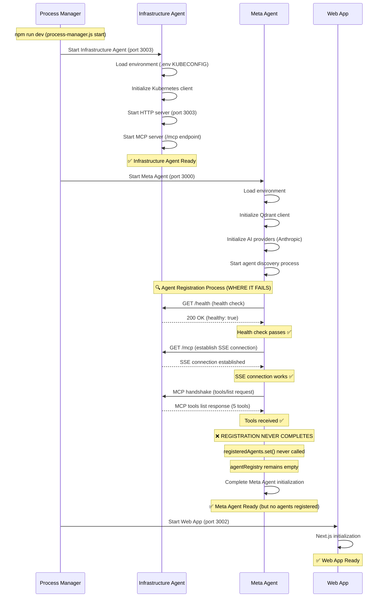
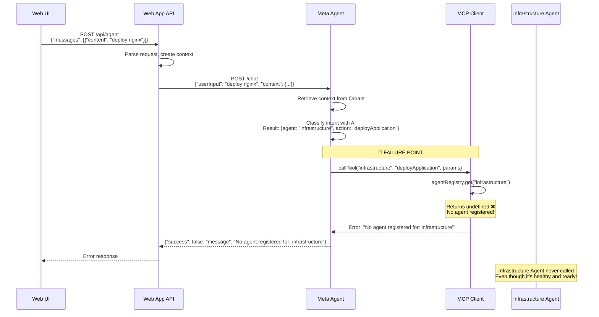
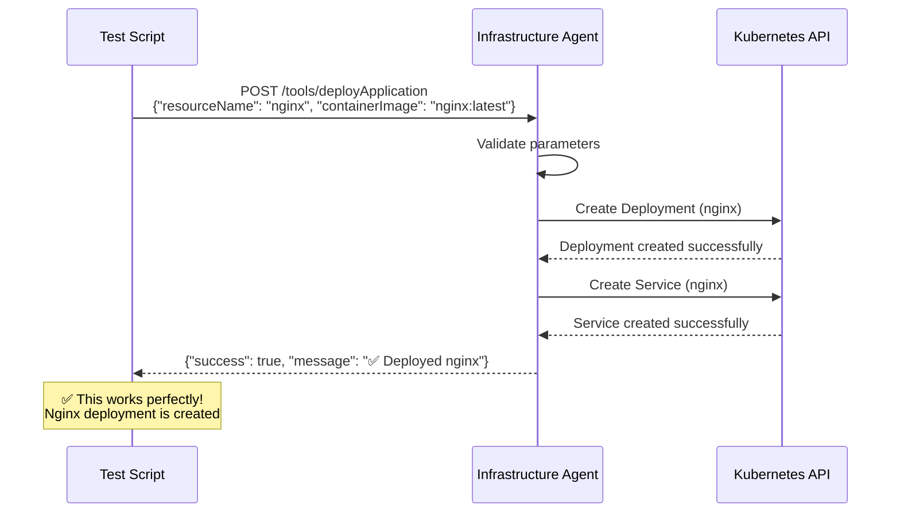
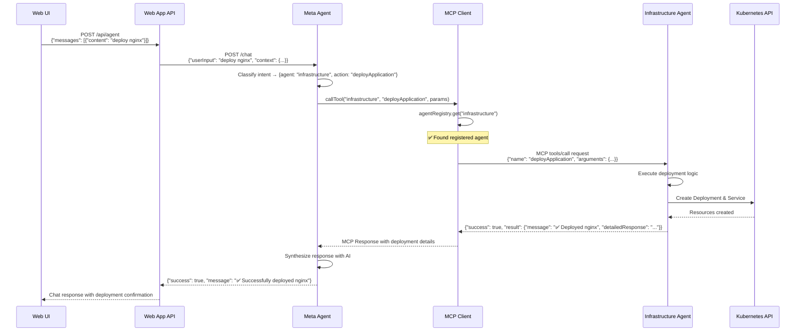
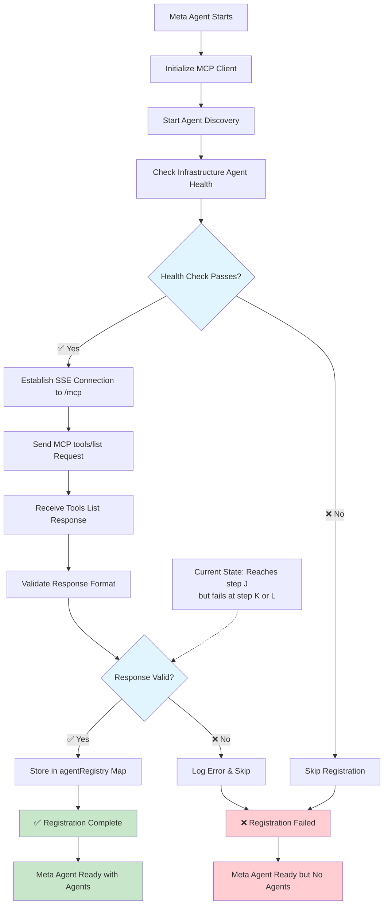
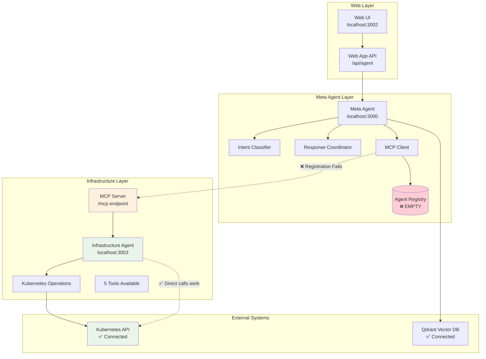

# AI-IDP Communication Flow Analysis

## 1. Service Startup and Registration Flow

## 2. Request Processing Flow (Current Broken State)

## 3. Direct Infrastructure Agent Call (What Works)

## 4. Expected Working Flow (Once Fixed)

## 5. Registration Failure Analysis

## 6. Architecture Overview with Failure Points

## Key Findings

### ✅ What Works:
1. **All services start successfully**
2. **Infrastructure Agent connects to real Kubernetes**
3. **Direct Infrastructure Agent API calls work perfectly**
4. **Meta Agent HTTP server is operational**
5. **Web App can reach Meta Agent**

### ❌ What Fails:
1. **MCP agent registration between Meta Agent and Infrastructure Agent**
2. **Agent registry in MCP Client remains empty**
3. **Meta Agent cannot route requests to Infrastructure Agent**

### 🔍 Root Cause:
The MCP registration handshake between Meta Agent and Infrastructure Agent fails at step K or L in the registration flow. The agents can communicate (health checks pass, SSE connects), but the final registration step that populates `agentRegistry.set("infrastructure", capabilities)` never completes.

### 🛠️ Next Steps:
1. Debug the MCP registration handshake
2. Check MCP protocol implementation between agents
3. Verify the tools/list response format matches expected schema
4. Add detailed logging to pinpoint exact failure in registration process