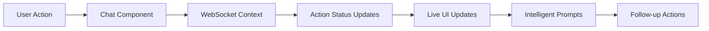

# AI-IDP Web Application 🌐

A modern Next.js web interface for the AI-Powered Integrated Developer Platform with real-time action tracking, intelligent prompts, and comprehensive monitoring capabilities.

## 🚀 Features

### **Real-time Action Tracking**
- Live WebSocket updates for all platform operations
- Progress tracking with detailed execution information
- Action status cards embedded in chat conversations
- Comprehensive dashboard with filtering and statistics

### **Intelligent User Experience**
- Context-aware follow-up suggestions after operations complete
- Automated failure investigation prompts with remediation steps
- Smart timeout handling with continuation options
- System-wide observability triggers and alerts

### **Conversational Platform Management**
- Natural language infrastructure operations
- Embedded action tracking within chat flow
- Parameter validation and namespace selection
- Human approval workflows for critical operations

### **Comprehensive Monitoring**
- Real-time action dashboard with advanced filtering
- Statistics overview (total, pending, running, completed, failed)
- Action history with sorting by time, progress, and status
- WebSocket connection status indicators

## 🏗️ Architecture

### **Key Components**

- **Chat Interface** (`/chat`): Conversational AI with embedded action tracking
- **Action Dashboard** (`/dashboard`): Comprehensive monitoring and statistics
- **Action Status Cards**: Reusable components for live progress display
- **WebSocket Context**: Real-time communication with backend services
- **Intelligent Prompts**: Smart suggestions based on action context

### **Real-time System**



## 🛠️ Technology Stack

- **Framework**: Next.js 15 with App Router
- **React**: React 19 with TypeScript
- **Styling**: Tailwind CSS v4
- **State Management**: React Context with WebSocket integration
- **Type Safety**: TypeScript with Zod schema validation
- **Real-time**: WebSocket connections for live updates

## 📱 Pages & Routes

- `/` - Homepage with feature overview and navigation
- `/chat` - Main chat interface with real-time action tracking
- `/dashboard` - Comprehensive action monitoring dashboard
- `/sessions` - Chat session history and management
- `/approvals` - Human approval workflow interface

## 🔧 Development

### Prerequisites
- Node.js 20+
- npm/yarn/pnpm
- Running backend services (Meta-Agent, Infrastructure Agent, Observability Agent)

### Setup

```bash
# Install dependencies
npm install

# Setup environment
cp .env.example .env.local
# Add required environment variables:
# NEXT_PUBLIC_META_AGENT_URL=ws://localhost:3000

# Start development server
npm run dev
```

### Available Scripts

```bash
npm run dev          # Start development server (port 3002)
npm run build        # Build for production
npm run start        # Start production server
npm run lint         # Run ESLint
npm run type-check   # TypeScript type checking
```

### Environment Variables

```bash
# Required
NEXT_PUBLIC_META_AGENT_URL=ws://localhost:3000

# Optional
NEXT_PUBLIC_ENABLE_ACTION_TRACKING=true
NEXT_PUBLIC_WEBSOCKET_RECONNECT_INTERVAL=3000
```

## 🎨 Components Overview

### **Core Components**

#### `ActionStatusCard`
Real-time action tracking component with:
- Live progress indicators
- Status updates (pending, running, completed, failed)
- Detailed execution metadata
- Expandable details view
- Completion/failure result display

#### `IntelligentPrompts` 
Smart suggestion system featuring:
- Context-aware follow-up actions
- Failure investigation prompts
- System-wide observability triggers
- Priority-based visual hierarchy
- One-click action execution

#### `ActionDashboard`
Comprehensive monitoring interface with:
- Real-time statistics overview
- Advanced filtering (status, agent, date)
- Multiple sorting options
- Live WebSocket connection status
- Action history management

#### `WebSocketContext`
Real-time communication layer providing:
- Automatic connection management
- Action subscription system  
- Live status update broadcasting
- Connection state monitoring
- Error handling and reconnection

### **Chat Integration**

The chat interface seamlessly integrates action tracking:
- Messages automatically detect action IDs
- Real-time status updates within conversations
- ActionStatusCard components appear below tracked messages
- Intelligent prompts surface contextually

### **Type Safety**

Complete TypeScript coverage with Zod schemas:
- `ActionRecord` - Core action tracking data
- `ActionUpdate` - WebSocket update messages  
- `IntelligentPrompt` - Smart suggestion data
- `ObservabilityTrigger` - System-wide alerts
- `ChatMessage` - Enhanced with action tracking fields

## 🔌 API Integration

### **WebSocket Events**

```typescript
// Action status updates
{
  type: 'action-update',
  payload: {
    actionId: string,
    status: 'pending' | 'running' | 'completed' | 'failed',
    progress: number,
    result?: { success: boolean, data: any }
  }
}

// System-wide triggers  
{
  type: 'observability-trigger',
  payload: {
    severity: 'warning' | 'error' | 'critical',
    title: string,
    description: string,
    recommendedAction: string
  }
}
```

### **HTTP Endpoints**

- `POST /api/agent` - Submit chat messages and receive responses
- `GET /api/sessions/{sessionId}` - Load chat session history
- WebSocket connection to Meta-Agent for real-time updates

## 🎯 User Experience

### **Intelligent Workflows**

1. **Deployment Follow-ups**: After successful deployments, users receive prompts for:
   - Application health checks
   - Monitoring setup
   - Auto-scaling configuration
   - Smoke tests

2. **Failure Investigation**: When operations fail, automatic prompts offer:
   - Detailed error log analysis
   - Resource availability checks
   - Retry with different parameters
   - Rollback options

3. **Timeout Handling**: For long-running operations:
   - Smart continuation prompts
   - Investigation suggestions
   - Background execution awareness
   - Resource constraint detection

### **Real-time Feedback**

- Live progress bars for ongoing operations
- WebSocket status indicators
- Immediate action status updates
- System-wide alert notifications

## 🚀 Production Deployment

### Build Optimization

```bash
# Production build with optimizations
npm run build

# Start production server
npm run start
```

### Performance Features

- **Static Generation**: Homepage and marketing pages
- **Server-Side Rendering**: Chat and dashboard pages
- **Code Splitting**: Automatic route-based splitting
- **WebSocket Optimization**: Efficient connection pooling
- **Type Safety**: Runtime validation with Zod schemas

## 📊 Monitoring & Analytics

- **Real-time Metrics**: Action creation rates, completion times
- **User Engagement**: Chat interaction patterns, dashboard usage
- **System Health**: WebSocket connection stability, error rates
- **Performance**: Page load times, component render optimization

## 🔒 Security

- **Input Validation**: All user inputs validated with Zod schemas
- **XSS Protection**: Sanitized content rendering
- **WebSocket Security**: Connection authentication and rate limiting
- **Session Management**: Secure session handling with unique IDs

---

**🎉 The AI-IDP Web Application provides a production-ready interface for conversational infrastructure management with real-time tracking, intelligent automation, and comprehensive monitoring capabilities.**